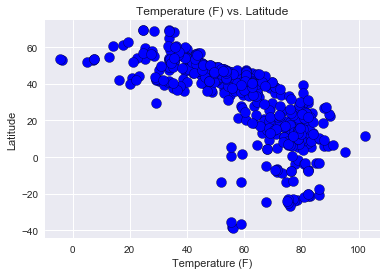
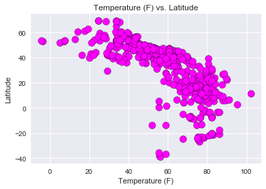
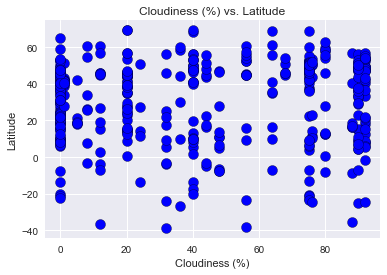
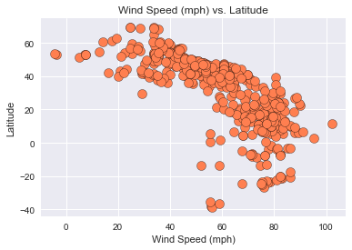

```python
# Dependencies
import pandas as pd
import numpy as np
import requests
import json
from citipy import citipy
import openweathermapy.core as owm
import random
from pprint import pprint
import matplotlib.pyplot as plt
import seaborn as sns
#import API key
from config import wkey
```


```python
# assigning variable to the citipy cities dictionary
city = citipy.WORLD_CITIES_DICT
#creating a city list to loop through citipy
cities=[]

#looping through citipy to get list of 500 random lat and longitude
for i in range(500):
   a = list(city)
   b = random.choice(a)
   cities.append(b)

#placing random list of 500 cities from citipy into a dataframe
import_df= pd.DataFrame(cities)

# New data frame with formated columns to hold randomly lat & lng & weather info
cities_df = pd.DataFrame()
cities_df["Latitude"] = import_df[0]
cities_df["Longitude"] = import_df[1]
cities_df["City Name"] = ""
cities_df["Country Code"] = ""
cities_df["Temperature"] = ""
cities_df["Cloudiness"] = ""
cities_df["Wind Speed"] = ""
cities_df["Humidity"] = ""

#cities_df.head()
```


```python
#looping through the latitude and longitude values from citypy to get the city name and country code
for index,row in cities_df.iterrows():
    city = citipy.nearest_city(row["Latitude"],row["Longitude"])
    cities_df.set_value(index,"City Name",city.city_name)
    cities_df.set_value(index,"Country Code",city.country_code)
    
#cities_df.head()
```

    C:\Users\brgrave1\Anaconda3\envs\PythonData\lib\site-packages\ipykernel_launcher.py:4: FutureWarning: set_value is deprecated and will be removed in a future release. Please use .at[] or .iat[] accessors instead
      after removing the cwd from sys.path.
    C:\Users\brgrave1\Anaconda3\envs\PythonData\lib\site-packages\ipykernel_launcher.py:5: FutureWarning: set_value is deprecated and will be removed in a future release. Please use .at[] or .iat[] accessors instead
      """
    


```python
# Create settings dictionary with information we're interested in

url = "http://api.openweathermap.org/data/2.5/weather?units=Imperial"
settings = {"units": "metric", "appid": wkey}
for index,row in cities_df.iterrows():
    city = row["City Name"]
    country = row ["Country Code"]
    city_country = str(city)+ "," + str(country)
    
    #using try and except method incase API has missing data for random sample of cities
    try:
        #creating variable for API call       
        current_weather_url = url + "&appid=" + wkey + "&q=" + city_country
        current_weather = requests.get(current_weather_url).json()
        #appending data pulled in the loop to the cities dataframe
        cities_df.set_value(index, "Temperature", current_weather.get("main",{}).get("temp"))
        cities_df.set_value(index, "Humidity", current_weather.get("main",{}).get("humidity"))
        cities_df.set_value(index, "Cloudiness", current_weather.get("clouds",{}).get("all"))
        cities_df.set_value(index, "Wind Speed", current_weather.get("wind",{}).get("speed"))
        print(f"Running Current Weather Information for {city}")
        print(current_weather_url)
    except:
        cities_df.set_value(index, "Temperature", current_weather.get("main",{}).get("temp"))
        cities_df.set_value(index, "Humidity", current_weather.get("main",{}).get("humidity"))
        cities_df.set_value(index, "Cloudiness", current_weather.get("clouds",{}).get("all"))
        cities_df.set_value(index, "Wind Speed", current_weather.get("wind",{}).get("speed"))
        print(f"No Data found for {city}")
        print(current_weather_url)  
              

```

    C:\Users\brgrave1\Anaconda3\envs\PythonData\lib\site-packages\ipykernel_launcher.py:16: FutureWarning: set_value is deprecated and will be removed in a future release. Please use .at[] or .iat[] accessors instead
      app.launch_new_instance()
    C:\Users\brgrave1\Anaconda3\envs\PythonData\lib\site-packages\ipykernel_launcher.py:17: FutureWarning: set_value is deprecated and will be removed in a future release. Please use .at[] or .iat[] accessors instead
    C:\Users\brgrave1\Anaconda3\envs\PythonData\lib\site-packages\ipykernel_launcher.py:18: FutureWarning: set_value is deprecated and will be removed in a future release. Please use .at[] or .iat[] accessors instead
    C:\Users\brgrave1\Anaconda3\envs\PythonData\lib\site-packages\ipykernel_launcher.py:19: FutureWarning: set_value is deprecated and will be removed in a future release. Please use .at[] or .iat[] accessors instead
    

    Running Current Weather Information for san jose acatempa
    http://api.openweathermap.org/data/2.5/weather?units=Imperial&appid=25bc90a1196e6f153eece0bc0b0fc9eb&q=san jose acatempa,gt
    Running Current Weather Information for tiszabercel
    http://api.openweathermap.org/data/2.5/weather?units=Imperial&appid=25bc90a1196e6f153eece0bc0b0fc9eb&q=tiszabercel,hu
    Running Current Weather Information for tinde
    http://api.openweathermap.org/data/2.5/weather?units=Imperial&appid=25bc90a1196e6f153eece0bc0b0fc9eb&q=tinde,tz
    Running Current Weather Information for naisud
    http://api.openweathermap.org/data/2.5/weather?units=Imperial&appid=25bc90a1196e6f153eece0bc0b0fc9eb&q=naisud,ph
    Running Current Weather Information for carmo do cajuru
    http://api.openweathermap.org/data/2.5/weather?units=Imperial&appid=25bc90a1196e6f153eece0bc0b0fc9eb&q=carmo do cajuru,br
    Running Current Weather Information for nova bystrice
    http://api.openweathermap.org/data/2.5/weather?units=Imperial&appid=25bc90a1196e6f153eece0bc0b0fc9eb&q=nova bystrice,cz
    Running Current Weather Information for midlothian
    http://api.openweathermap.org/data/2.5/weather?units=Imperial&appid=25bc90a1196e6f153eece0bc0b0fc9eb&q=midlothian,us
    Running Current Weather Information for balabanovo
    http://api.openweathermap.org/data/2.5/weather?units=Imperial&appid=25bc90a1196e6f153eece0bc0b0fc9eb&q=balabanovo,ru
    Running Current Weather Information for tole
    http://api.openweathermap.org/data/2.5/weather?units=Imperial&appid=25bc90a1196e6f153eece0bc0b0fc9eb&q=tole,pa
    Running Current Weather Information for kogon
    http://api.openweathermap.org/data/2.5/weather?units=Imperial&appid=25bc90a1196e6f153eece0bc0b0fc9eb&q=kogon,uz
    Running Current Weather Information for brestovat
    http://api.openweathermap.org/data/2.5/weather?units=Imperial&appid=25bc90a1196e6f153eece0bc0b0fc9eb&q=brestovat,ro
    Running Current Weather Information for tomislavgrad
    http://api.openweathermap.org/data/2.5/weather?units=Imperial&appid=25bc90a1196e6f153eece0bc0b0fc9eb&q=tomislavgrad,ba
    Running Current Weather Information for lomme
    http://api.openweathermap.org/data/2.5/weather?units=Imperial&appid=25bc90a1196e6f153eece0bc0b0fc9eb&q=lomme,fr
    Running Current Weather Information for marasesti
    http://api.openweathermap.org/data/2.5/weather?units=Imperial&appid=25bc90a1196e6f153eece0bc0b0fc9eb&q=marasesti,ro
    Running Current Weather Information for dentsville
    http://api.openweathermap.org/data/2.5/weather?units=Imperial&appid=25bc90a1196e6f153eece0bc0b0fc9eb&q=dentsville,us
    Running Current Weather Information for achit
    http://api.openweathermap.org/data/2.5/weather?units=Imperial&appid=25bc90a1196e6f153eece0bc0b0fc9eb&q=achit,ru
    Running Current Weather Information for coventry
    http://api.openweathermap.org/data/2.5/weather?units=Imperial&appid=25bc90a1196e6f153eece0bc0b0fc9eb&q=coventry,us
    Running Current Weather Information for rudnytsya
    http://api.openweathermap.org/data/2.5/weather?units=Imperial&appid=25bc90a1196e6f153eece0bc0b0fc9eb&q=rudnytsya,ua
    Running Current Weather Information for schortens
    http://api.openweathermap.org/data/2.5/weather?units=Imperial&appid=25bc90a1196e6f153eece0bc0b0fc9eb&q=schortens,de
    Running Current Weather Information for bhimunipatnam
    http://api.openweathermap.org/data/2.5/weather?units=Imperial&appid=25bc90a1196e6f153eece0bc0b0fc9eb&q=bhimunipatnam,in
    Running Current Weather Information for mascalucia
    http://api.openweathermap.org/data/2.5/weather?units=Imperial&appid=25bc90a1196e6f153eece0bc0b0fc9eb&q=mascalucia,it
    Running Current Weather Information for chicago heights
    http://api.openweathermap.org/data/2.5/weather?units=Imperial&appid=25bc90a1196e6f153eece0bc0b0fc9eb&q=chicago heights,us
    Running Current Weather Information for golakganj
    http://api.openweathermap.org/data/2.5/weather?units=Imperial&appid=25bc90a1196e6f153eece0bc0b0fc9eb&q=golakganj,in
    Running Current Weather Information for berezniki
    http://api.openweathermap.org/data/2.5/weather?units=Imperial&appid=25bc90a1196e6f153eece0bc0b0fc9eb&q=berezniki,ru
    Running Current Weather Information for biled
    http://api.openweathermap.org/data/2.5/weather?units=Imperial&appid=25bc90a1196e6f153eece0bc0b0fc9eb&q=biled,ro
    Running Current Weather Information for parksville
    http://api.openweathermap.org/data/2.5/weather?units=Imperial&appid=25bc90a1196e6f153eece0bc0b0fc9eb&q=parksville,ca
    Running Current Weather Information for savinka
    http://api.openweathermap.org/data/2.5/weather?units=Imperial&appid=25bc90a1196e6f153eece0bc0b0fc9eb&q=savinka,ru
    Running Current Weather Information for busilac
    http://api.openweathermap.org/data/2.5/weather?units=Imperial&appid=25bc90a1196e6f153eece0bc0b0fc9eb&q=busilac,ph
    Running Current Weather Information for portland
    http://api.openweathermap.org/data/2.5/weather?units=Imperial&appid=25bc90a1196e6f153eece0bc0b0fc9eb&q=portland,au
    Running Current Weather Information for freiberg
    http://api.openweathermap.org/data/2.5/weather?units=Imperial&appid=25bc90a1196e6f153eece0bc0b0fc9eb&q=freiberg,de
    Running Current Weather Information for lyubar
    http://api.openweathermap.org/data/2.5/weather?units=Imperial&appid=25bc90a1196e6f153eece0bc0b0fc9eb&q=lyubar,ua
    Running Current Weather Information for ayios nikolaos
    http://api.openweathermap.org/data/2.5/weather?units=Imperial&appid=25bc90a1196e6f153eece0bc0b0fc9eb&q=ayios nikolaos,gr
    Running Current Weather Information for zemetchino
    http://api.openweathermap.org/data/2.5/weather?units=Imperial&appid=25bc90a1196e6f153eece0bc0b0fc9eb&q=zemetchino,ru
    Running Current Weather Information for la grange
    http://api.openweathermap.org/data/2.5/weather?units=Imperial&appid=25bc90a1196e6f153eece0bc0b0fc9eb&q=la grange,us
    Running Current Weather Information for chiesd
    http://api.openweathermap.org/data/2.5/weather?units=Imperial&appid=25bc90a1196e6f153eece0bc0b0fc9eb&q=chiesd,ro
    Running Current Weather Information for tamboril
    http://api.openweathermap.org/data/2.5/weather?units=Imperial&appid=25bc90a1196e6f153eece0bc0b0fc9eb&q=tamboril,do
    Running Current Weather Information for capitao poco
    http://api.openweathermap.org/data/2.5/weather?units=Imperial&appid=25bc90a1196e6f153eece0bc0b0fc9eb&q=capitao poco,br
    Running Current Weather Information for sirsilla
    http://api.openweathermap.org/data/2.5/weather?units=Imperial&appid=25bc90a1196e6f153eece0bc0b0fc9eb&q=sirsilla,in
    Running Current Weather Information for dobretu
    http://api.openweathermap.org/data/2.5/weather?units=Imperial&appid=25bc90a1196e6f153eece0bc0b0fc9eb&q=dobretu,ro
    Running Current Weather Information for bhinga
    http://api.openweathermap.org/data/2.5/weather?units=Imperial&appid=25bc90a1196e6f153eece0bc0b0fc9eb&q=bhinga,in
    Running Current Weather Information for vladesti
    http://api.openweathermap.org/data/2.5/weather?units=Imperial&appid=25bc90a1196e6f153eece0bc0b0fc9eb&q=vladesti,ro
    Running Current Weather Information for cagdianao
    http://api.openweathermap.org/data/2.5/weather?units=Imperial&appid=25bc90a1196e6f153eece0bc0b0fc9eb&q=cagdianao,ph
    Running Current Weather Information for bolshoye soldatskoye
    http://api.openweathermap.org/data/2.5/weather?units=Imperial&appid=25bc90a1196e6f153eece0bc0b0fc9eb&q=bolshoye soldatskoye,ru
    Running Current Weather Information for huldenberg
    http://api.openweathermap.org/data/2.5/weather?units=Imperial&appid=25bc90a1196e6f153eece0bc0b0fc9eb&q=huldenberg,be
    Running Current Weather Information for wonthaggi
    http://api.openweathermap.org/data/2.5/weather?units=Imperial&appid=25bc90a1196e6f153eece0bc0b0fc9eb&q=wonthaggi,au
    Running Current Weather Information for broken arrow
    http://api.openweathermap.org/data/2.5/weather?units=Imperial&appid=25bc90a1196e6f153eece0bc0b0fc9eb&q=broken arrow,us
    Running Current Weather Information for kostelec nad orlici
    http://api.openweathermap.org/data/2.5/weather?units=Imperial&appid=25bc90a1196e6f153eece0bc0b0fc9eb&q=kostelec nad orlici,cz
    Running Current Weather Information for bakurianis andeziti
    http://api.openweathermap.org/data/2.5/weather?units=Imperial&appid=25bc90a1196e6f153eece0bc0b0fc9eb&q=bakurianis andeziti,ge
    Running Current Weather Information for almeirim
    http://api.openweathermap.org/data/2.5/weather?units=Imperial&appid=25bc90a1196e6f153eece0bc0b0fc9eb&q=almeirim,pt
    Running Current Weather Information for anenecuilco
    http://api.openweathermap.org/data/2.5/weather?units=Imperial&appid=25bc90a1196e6f153eece0bc0b0fc9eb&q=anenecuilco,mx
    Running Current Weather Information for manguito
    http://api.openweathermap.org/data/2.5/weather?units=Imperial&appid=25bc90a1196e6f153eece0bc0b0fc9eb&q=manguito,cu
    Running Current Weather Information for malatap
    http://api.openweathermap.org/data/2.5/weather?units=Imperial&appid=25bc90a1196e6f153eece0bc0b0fc9eb&q=malatap,ph
    Running Current Weather Information for livadia
    http://api.openweathermap.org/data/2.5/weather?units=Imperial&appid=25bc90a1196e6f153eece0bc0b0fc9eb&q=livadia,cy
    Running Current Weather Information for bhagalpur
    http://api.openweathermap.org/data/2.5/weather?units=Imperial&appid=25bc90a1196e6f153eece0bc0b0fc9eb&q=bhagalpur,in
    Running Current Weather Information for cavite
    http://api.openweathermap.org/data/2.5/weather?units=Imperial&appid=25bc90a1196e6f153eece0bc0b0fc9eb&q=cavite,ph
    Running Current Weather Information for pozorice
    http://api.openweathermap.org/data/2.5/weather?units=Imperial&appid=25bc90a1196e6f153eece0bc0b0fc9eb&q=pozorice,cz
    Running Current Weather Information for laiyang
    http://api.openweathermap.org/data/2.5/weather?units=Imperial&appid=25bc90a1196e6f153eece0bc0b0fc9eb&q=laiyang,cn
    Running Current Weather Information for karkal
    http://api.openweathermap.org/data/2.5/weather?units=Imperial&appid=25bc90a1196e6f153eece0bc0b0fc9eb&q=karkal,in
    Running Current Weather Information for chum phae
    http://api.openweathermap.org/data/2.5/weather?units=Imperial&appid=25bc90a1196e6f153eece0bc0b0fc9eb&q=chum phae,th
    Running Current Weather Information for las varas
    http://api.openweathermap.org/data/2.5/weather?units=Imperial&appid=25bc90a1196e6f153eece0bc0b0fc9eb&q=las varas,mx
    Running Current Weather Information for usolye-sibirskoye
    http://api.openweathermap.org/data/2.5/weather?units=Imperial&appid=25bc90a1196e6f153eece0bc0b0fc9eb&q=usolye-sibirskoye,ru
    Running Current Weather Information for gostinu
    http://api.openweathermap.org/data/2.5/weather?units=Imperial&appid=25bc90a1196e6f153eece0bc0b0fc9eb&q=gostinu,ro
    Running Current Weather Information for tlalpujahua
    http://api.openweathermap.org/data/2.5/weather?units=Imperial&appid=25bc90a1196e6f153eece0bc0b0fc9eb&q=tlalpujahua,mx
    Running Current Weather Information for tepetlaoxtoc
    http://api.openweathermap.org/data/2.5/weather?units=Imperial&appid=25bc90a1196e6f153eece0bc0b0fc9eb&q=tepetlaoxtoc,mx
    Running Current Weather Information for bayan
    http://api.openweathermap.org/data/2.5/weather?units=Imperial&appid=25bc90a1196e6f153eece0bc0b0fc9eb&q=bayan,kw
    Running Current Weather Information for biscarrosse
    http://api.openweathermap.org/data/2.5/weather?units=Imperial&appid=25bc90a1196e6f153eece0bc0b0fc9eb&q=biscarrosse,fr
    Running Current Weather Information for matagalpa
    http://api.openweathermap.org/data/2.5/weather?units=Imperial&appid=25bc90a1196e6f153eece0bc0b0fc9eb&q=matagalpa,ni
    Running Current Weather Information for sarangani
    http://api.openweathermap.org/data/2.5/weather?units=Imperial&appid=25bc90a1196e6f153eece0bc0b0fc9eb&q=sarangani,ph
    Running Current Weather Information for bandarbeyla
    http://api.openweathermap.org/data/2.5/weather?units=Imperial&appid=25bc90a1196e6f153eece0bc0b0fc9eb&q=bandarbeyla,so
    Running Current Weather Information for vieques
    http://api.openweathermap.org/data/2.5/weather?units=Imperial&appid=25bc90a1196e6f153eece0bc0b0fc9eb&q=vieques,us
    Running Current Weather Information for prague
    http://api.openweathermap.org/data/2.5/weather?units=Imperial&appid=25bc90a1196e6f153eece0bc0b0fc9eb&q=prague,cz
    Running Current Weather Information for erie
    http://api.openweathermap.org/data/2.5/weather?units=Imperial&appid=25bc90a1196e6f153eece0bc0b0fc9eb&q=erie,us
    Running Current Weather Information for moria
    http://api.openweathermap.org/data/2.5/weather?units=Imperial&appid=25bc90a1196e6f153eece0bc0b0fc9eb&q=moria,gr
    Running Current Weather Information for topana
    http://api.openweathermap.org/data/2.5/weather?units=Imperial&appid=25bc90a1196e6f153eece0bc0b0fc9eb&q=topana,ro
    Running Current Weather Information for salumbar
    http://api.openweathermap.org/data/2.5/weather?units=Imperial&appid=25bc90a1196e6f153eece0bc0b0fc9eb&q=salumbar,in
    Running Current Weather Information for tatarani
    http://api.openweathermap.org/data/2.5/weather?units=Imperial&appid=25bc90a1196e6f153eece0bc0b0fc9eb&q=tatarani,ro
    Running Current Weather Information for chhagalnaiya
    http://api.openweathermap.org/data/2.5/weather?units=Imperial&appid=25bc90a1196e6f153eece0bc0b0fc9eb&q=chhagalnaiya,bd
    Running Current Weather Information for brejning
    http://api.openweathermap.org/data/2.5/weather?units=Imperial&appid=25bc90a1196e6f153eece0bc0b0fc9eb&q=brejning,dk
    Running Current Weather Information for kencong
    http://api.openweathermap.org/data/2.5/weather?units=Imperial&appid=25bc90a1196e6f153eece0bc0b0fc9eb&q=kencong,id
    Running Current Weather Information for sura mica
    http://api.openweathermap.org/data/2.5/weather?units=Imperial&appid=25bc90a1196e6f153eece0bc0b0fc9eb&q=sura mica,ro
    Running Current Weather Information for playia
    http://api.openweathermap.org/data/2.5/weather?units=Imperial&appid=25bc90a1196e6f153eece0bc0b0fc9eb&q=playia,gr
    Running Current Weather Information for cabatuan
    http://api.openweathermap.org/data/2.5/weather?units=Imperial&appid=25bc90a1196e6f153eece0bc0b0fc9eb&q=cabatuan,ph
    Running Current Weather Information for usolye
    http://api.openweathermap.org/data/2.5/weather?units=Imperial&appid=25bc90a1196e6f153eece0bc0b0fc9eb&q=usolye,ru
    Running Current Weather Information for san antonio
    http://api.openweathermap.org/data/2.5/weather?units=Imperial&appid=25bc90a1196e6f153eece0bc0b0fc9eb&q=san antonio,cr
    Running Current Weather Information for lensk
    http://api.openweathermap.org/data/2.5/weather?units=Imperial&appid=25bc90a1196e6f153eece0bc0b0fc9eb&q=lensk,ru
    Running Current Weather Information for narwana
    http://api.openweathermap.org/data/2.5/weather?units=Imperial&appid=25bc90a1196e6f153eece0bc0b0fc9eb&q=narwana,in
    Running Current Weather Information for asilah
    http://api.openweathermap.org/data/2.5/weather?units=Imperial&appid=25bc90a1196e6f153eece0bc0b0fc9eb&q=asilah,ma
    Running Current Weather Information for hita
    http://api.openweathermap.org/data/2.5/weather?units=Imperial&appid=25bc90a1196e6f153eece0bc0b0fc9eb&q=hita,jp
    Running Current Weather Information for caoayan
    http://api.openweathermap.org/data/2.5/weather?units=Imperial&appid=25bc90a1196e6f153eece0bc0b0fc9eb&q=caoayan,ph
    Running Current Weather Information for cabimas
    http://api.openweathermap.org/data/2.5/weather?units=Imperial&appid=25bc90a1196e6f153eece0bc0b0fc9eb&q=cabimas,ve
    Running Current Weather Information for kondoa
    http://api.openweathermap.org/data/2.5/weather?units=Imperial&appid=25bc90a1196e6f153eece0bc0b0fc9eb&q=kondoa,tz
    Running Current Weather Information for anqiu
    http://api.openweathermap.org/data/2.5/weather?units=Imperial&appid=25bc90a1196e6f153eece0bc0b0fc9eb&q=anqiu,cn
    Running Current Weather Information for ikauna
    http://api.openweathermap.org/data/2.5/weather?units=Imperial&appid=25bc90a1196e6f153eece0bc0b0fc9eb&q=ikauna,in
    Running Current Weather Information for sovetskaya
    http://api.openweathermap.org/data/2.5/weather?units=Imperial&appid=25bc90a1196e6f153eece0bc0b0fc9eb&q=sovetskaya,ru
    Running Current Weather Information for zhongxing
    http://api.openweathermap.org/data/2.5/weather?units=Imperial&appid=25bc90a1196e6f153eece0bc0b0fc9eb&q=zhongxing,cn
    Running Current Weather Information for kirkland
    http://api.openweathermap.org/data/2.5/weather?units=Imperial&appid=25bc90a1196e6f153eece0bc0b0fc9eb&q=kirkland,us
    Running Current Weather Information for cristinesti
    http://api.openweathermap.org/data/2.5/weather?units=Imperial&appid=25bc90a1196e6f153eece0bc0b0fc9eb&q=cristinesti,ro
    Running Current Weather Information for macaracas
    http://api.openweathermap.org/data/2.5/weather?units=Imperial&appid=25bc90a1196e6f153eece0bc0b0fc9eb&q=macaracas,pa
    Running Current Weather Information for san pelayo
    http://api.openweathermap.org/data/2.5/weather?units=Imperial&appid=25bc90a1196e6f153eece0bc0b0fc9eb&q=san pelayo,co
    Running Current Weather Information for tinqueux
    http://api.openweathermap.org/data/2.5/weather?units=Imperial&appid=25bc90a1196e6f153eece0bc0b0fc9eb&q=tinqueux,fr
    Running Current Weather Information for creteni
    http://api.openweathermap.org/data/2.5/weather?units=Imperial&appid=25bc90a1196e6f153eece0bc0b0fc9eb&q=creteni,ro
    Running Current Weather Information for kravare
    http://api.openweathermap.org/data/2.5/weather?units=Imperial&appid=25bc90a1196e6f153eece0bc0b0fc9eb&q=kravare,cz
    Running Current Weather Information for upig
    http://api.openweathermap.org/data/2.5/weather?units=Imperial&appid=25bc90a1196e6f153eece0bc0b0fc9eb&q=upig,ph
    Running Current Weather Information for tierralta
    http://api.openweathermap.org/data/2.5/weather?units=Imperial&appid=25bc90a1196e6f153eece0bc0b0fc9eb&q=tierralta,co
    Running Current Weather Information for komlo
    http://api.openweathermap.org/data/2.5/weather?units=Imperial&appid=25bc90a1196e6f153eece0bc0b0fc9eb&q=komlo,hu
    Running Current Weather Information for brzi brod
    http://api.openweathermap.org/data/2.5/weather?units=Imperial&appid=25bc90a1196e6f153eece0bc0b0fc9eb&q=brzi brod,rs
    Running Current Weather Information for yelizavetinskoye
    http://api.openweathermap.org/data/2.5/weather?units=Imperial&appid=25bc90a1196e6f153eece0bc0b0fc9eb&q=yelizavetinskoye,ru
    Running Current Weather Information for ipiales
    http://api.openweathermap.org/data/2.5/weather?units=Imperial&appid=25bc90a1196e6f153eece0bc0b0fc9eb&q=ipiales,co
    Running Current Weather Information for sibirtsevo
    http://api.openweathermap.org/data/2.5/weather?units=Imperial&appid=25bc90a1196e6f153eece0bc0b0fc9eb&q=sibirtsevo,ru
    Running Current Weather Information for salatig
    http://api.openweathermap.org/data/2.5/weather?units=Imperial&appid=25bc90a1196e6f153eece0bc0b0fc9eb&q=salatig,ro
    Running Current Weather Information for racos
    http://api.openweathermap.org/data/2.5/weather?units=Imperial&appid=25bc90a1196e6f153eece0bc0b0fc9eb&q=racos,ro
    Running Current Weather Information for irvine
    http://api.openweathermap.org/data/2.5/weather?units=Imperial&appid=25bc90a1196e6f153eece0bc0b0fc9eb&q=irvine,us
    Running Current Weather Information for raypur
    http://api.openweathermap.org/data/2.5/weather?units=Imperial&appid=25bc90a1196e6f153eece0bc0b0fc9eb&q=raypur,in
    Running Current Weather Information for sita buzaului
    http://api.openweathermap.org/data/2.5/weather?units=Imperial&appid=25bc90a1196e6f153eece0bc0b0fc9eb&q=sita buzaului,ro
    Running Current Weather Information for bogdanesti
    http://api.openweathermap.org/data/2.5/weather?units=Imperial&appid=25bc90a1196e6f153eece0bc0b0fc9eb&q=bogdanesti,ro
    Running Current Weather Information for barsovo
    http://api.openweathermap.org/data/2.5/weather?units=Imperial&appid=25bc90a1196e6f153eece0bc0b0fc9eb&q=barsovo,ru
    Running Current Weather Information for chapadinha
    http://api.openweathermap.org/data/2.5/weather?units=Imperial&appid=25bc90a1196e6f153eece0bc0b0fc9eb&q=chapadinha,br
    Running Current Weather Information for varnavas
    http://api.openweathermap.org/data/2.5/weather?units=Imperial&appid=25bc90a1196e6f153eece0bc0b0fc9eb&q=varnavas,gr
    Running Current Weather Information for panlinlang
    http://api.openweathermap.org/data/2.5/weather?units=Imperial&appid=25bc90a1196e6f153eece0bc0b0fc9eb&q=panlinlang,ph
    Running Current Weather Information for las choapas
    http://api.openweathermap.org/data/2.5/weather?units=Imperial&appid=25bc90a1196e6f153eece0bc0b0fc9eb&q=las choapas,mx
    Running Current Weather Information for camargo
    http://api.openweathermap.org/data/2.5/weather?units=Imperial&appid=25bc90a1196e6f153eece0bc0b0fc9eb&q=camargo,mx
    Running Current Weather Information for canora
    http://api.openweathermap.org/data/2.5/weather?units=Imperial&appid=25bc90a1196e6f153eece0bc0b0fc9eb&q=canora,ca
    Running Current Weather Information for manacapuru
    http://api.openweathermap.org/data/2.5/weather?units=Imperial&appid=25bc90a1196e6f153eece0bc0b0fc9eb&q=manacapuru,br
    Running Current Weather Information for san vito al tagliamento
    http://api.openweathermap.org/data/2.5/weather?units=Imperial&appid=25bc90a1196e6f153eece0bc0b0fc9eb&q=san vito al tagliamento,it
    Running Current Weather Information for montrose
    http://api.openweathermap.org/data/2.5/weather?units=Imperial&appid=25bc90a1196e6f153eece0bc0b0fc9eb&q=montrose,gb
    Running Current Weather Information for aracoiaba da serra
    http://api.openweathermap.org/data/2.5/weather?units=Imperial&appid=25bc90a1196e6f153eece0bc0b0fc9eb&q=aracoiaba da serra,br
    Running Current Weather Information for las conchas
    http://api.openweathermap.org/data/2.5/weather?units=Imperial&appid=25bc90a1196e6f153eece0bc0b0fc9eb&q=las conchas,hn
    Running Current Weather Information for sayla
    http://api.openweathermap.org/data/2.5/weather?units=Imperial&appid=25bc90a1196e6f153eece0bc0b0fc9eb&q=sayla,in
    Running Current Weather Information for wangdiphodrang
    http://api.openweathermap.org/data/2.5/weather?units=Imperial&appid=25bc90a1196e6f153eece0bc0b0fc9eb&q=wangdiphodrang,bt
    Running Current Weather Information for middlesex
    http://api.openweathermap.org/data/2.5/weather?units=Imperial&appid=25bc90a1196e6f153eece0bc0b0fc9eb&q=middlesex,us
    Running Current Weather Information for rudbar
    http://api.openweathermap.org/data/2.5/weather?units=Imperial&appid=25bc90a1196e6f153eece0bc0b0fc9eb&q=rudbar,ir
    Running Current Weather Information for subcetate
    http://api.openweathermap.org/data/2.5/weather?units=Imperial&appid=25bc90a1196e6f153eece0bc0b0fc9eb&q=subcetate,ro
    Running Current Weather Information for khon kaen
    http://api.openweathermap.org/data/2.5/weather?units=Imperial&appid=25bc90a1196e6f153eece0bc0b0fc9eb&q=khon kaen,th
    Running Current Weather Information for dobrljin
    http://api.openweathermap.org/data/2.5/weather?units=Imperial&appid=25bc90a1196e6f153eece0bc0b0fc9eb&q=dobrljin,ba
    Running Current Weather Information for thrapsanon
    http://api.openweathermap.org/data/2.5/weather?units=Imperial&appid=25bc90a1196e6f153eece0bc0b0fc9eb&q=thrapsanon,gr
    Running Current Weather Information for sidi bu zayd
    http://api.openweathermap.org/data/2.5/weather?units=Imperial&appid=25bc90a1196e6f153eece0bc0b0fc9eb&q=sidi bu zayd,tn
    Running Current Weather Information for roi et
    http://api.openweathermap.org/data/2.5/weather?units=Imperial&appid=25bc90a1196e6f153eece0bc0b0fc9eb&q=roi et,th
    Running Current Weather Information for merzifon
    http://api.openweathermap.org/data/2.5/weather?units=Imperial&appid=25bc90a1196e6f153eece0bc0b0fc9eb&q=merzifon,tr
    Running Current Weather Information for santa apolonia
    http://api.openweathermap.org/data/2.5/weather?units=Imperial&appid=25bc90a1196e6f153eece0bc0b0fc9eb&q=santa apolonia,gt
    Running Current Weather Information for coevorden
    http://api.openweathermap.org/data/2.5/weather?units=Imperial&appid=25bc90a1196e6f153eece0bc0b0fc9eb&q=coevorden,nl
    Running Current Weather Information for cecava
    http://api.openweathermap.org/data/2.5/weather?units=Imperial&appid=25bc90a1196e6f153eece0bc0b0fc9eb&q=cecava,ba
    Running Current Weather Information for haltom city
    http://api.openweathermap.org/data/2.5/weather?units=Imperial&appid=25bc90a1196e6f153eece0bc0b0fc9eb&q=haltom city,us
    Running Current Weather Information for jalapilla
    http://api.openweathermap.org/data/2.5/weather?units=Imperial&appid=25bc90a1196e6f153eece0bc0b0fc9eb&q=jalapilla,mx
    Running Current Weather Information for tiquicheo
    http://api.openweathermap.org/data/2.5/weather?units=Imperial&appid=25bc90a1196e6f153eece0bc0b0fc9eb&q=tiquicheo,mx
    Running Current Weather Information for berea
    http://api.openweathermap.org/data/2.5/weather?units=Imperial&appid=25bc90a1196e6f153eece0bc0b0fc9eb&q=berea,us
    Running Current Weather Information for piedade
    http://api.openweathermap.org/data/2.5/weather?units=Imperial&appid=25bc90a1196e6f153eece0bc0b0fc9eb&q=piedade,br
    Running Current Weather Information for brusyanskiy
    http://api.openweathermap.org/data/2.5/weather?units=Imperial&appid=25bc90a1196e6f153eece0bc0b0fc9eb&q=brusyanskiy,ru
    Running Current Weather Information for armeria
    http://api.openweathermap.org/data/2.5/weather?units=Imperial&appid=25bc90a1196e6f153eece0bc0b0fc9eb&q=armeria,mx
    Running Current Weather Information for benalla
    http://api.openweathermap.org/data/2.5/weather?units=Imperial&appid=25bc90a1196e6f153eece0bc0b0fc9eb&q=benalla,au
    Running Current Weather Information for coevorden
    http://api.openweathermap.org/data/2.5/weather?units=Imperial&appid=25bc90a1196e6f153eece0bc0b0fc9eb&q=coevorden,nl
    Running Current Weather Information for gemunden
    http://api.openweathermap.org/data/2.5/weather?units=Imperial&appid=25bc90a1196e6f153eece0bc0b0fc9eb&q=gemunden,de
    Running Current Weather Information for katsuura
    http://api.openweathermap.org/data/2.5/weather?units=Imperial&appid=25bc90a1196e6f153eece0bc0b0fc9eb&q=katsuura,jp
    Running Current Weather Information for chiredzi
    http://api.openweathermap.org/data/2.5/weather?units=Imperial&appid=25bc90a1196e6f153eece0bc0b0fc9eb&q=chiredzi,zw
    Running Current Weather Information for gogosari
    http://api.openweathermap.org/data/2.5/weather?units=Imperial&appid=25bc90a1196e6f153eece0bc0b0fc9eb&q=gogosari,ro
    Running Current Weather Information for berlin
    http://api.openweathermap.org/data/2.5/weather?units=Imperial&appid=25bc90a1196e6f153eece0bc0b0fc9eb&q=berlin,de
    Running Current Weather Information for santa maria chiquimula
    http://api.openweathermap.org/data/2.5/weather?units=Imperial&appid=25bc90a1196e6f153eece0bc0b0fc9eb&q=santa maria chiquimula,gt
    Running Current Weather Information for baicoi
    http://api.openweathermap.org/data/2.5/weather?units=Imperial&appid=25bc90a1196e6f153eece0bc0b0fc9eb&q=baicoi,ro
    Running Current Weather Information for tongzi
    http://api.openweathermap.org/data/2.5/weather?units=Imperial&appid=25bc90a1196e6f153eece0bc0b0fc9eb&q=tongzi,cn
    Running Current Weather Information for ameca
    http://api.openweathermap.org/data/2.5/weather?units=Imperial&appid=25bc90a1196e6f153eece0bc0b0fc9eb&q=ameca,mx
    Running Current Weather Information for el higo
    http://api.openweathermap.org/data/2.5/weather?units=Imperial&appid=25bc90a1196e6f153eece0bc0b0fc9eb&q=el higo,mx
    Running Current Weather Information for kurobe
    http://api.openweathermap.org/data/2.5/weather?units=Imperial&appid=25bc90a1196e6f153eece0bc0b0fc9eb&q=kurobe,jp
    Running Current Weather Information for meyungs
    http://api.openweathermap.org/data/2.5/weather?units=Imperial&appid=25bc90a1196e6f153eece0bc0b0fc9eb&q=meyungs,pw
    Running Current Weather Information for cuitzeo
    http://api.openweathermap.org/data/2.5/weather?units=Imperial&appid=25bc90a1196e6f153eece0bc0b0fc9eb&q=cuitzeo,mx
    Running Current Weather Information for villiers-le-bel
    http://api.openweathermap.org/data/2.5/weather?units=Imperial&appid=25bc90a1196e6f153eece0bc0b0fc9eb&q=villiers-le-bel,fr
    Running Current Weather Information for alagoa grande
    http://api.openweathermap.org/data/2.5/weather?units=Imperial&appid=25bc90a1196e6f153eece0bc0b0fc9eb&q=alagoa grande,br
    Running Current Weather Information for topana
    http://api.openweathermap.org/data/2.5/weather?units=Imperial&appid=25bc90a1196e6f153eece0bc0b0fc9eb&q=topana,ro
    Running Current Weather Information for khania
    http://api.openweathermap.org/data/2.5/weather?units=Imperial&appid=25bc90a1196e6f153eece0bc0b0fc9eb&q=khania,gr
    Running Current Weather Information for khani
    http://api.openweathermap.org/data/2.5/weather?units=Imperial&appid=25bc90a1196e6f153eece0bc0b0fc9eb&q=khani,ru
    Running Current Weather Information for jabinyanah
    http://api.openweathermap.org/data/2.5/weather?units=Imperial&appid=25bc90a1196e6f153eece0bc0b0fc9eb&q=jabinyanah,tn
    Running Current Weather Information for ponazyrevo
    http://api.openweathermap.org/data/2.5/weather?units=Imperial&appid=25bc90a1196e6f153eece0bc0b0fc9eb&q=ponazyrevo,ru
    Running Current Weather Information for viking
    http://api.openweathermap.org/data/2.5/weather?units=Imperial&appid=25bc90a1196e6f153eece0bc0b0fc9eb&q=viking,ca
    Running Current Weather Information for karmala
    http://api.openweathermap.org/data/2.5/weather?units=Imperial&appid=25bc90a1196e6f153eece0bc0b0fc9eb&q=karmala,in
    Running Current Weather Information for darvari
    http://api.openweathermap.org/data/2.5/weather?units=Imperial&appid=25bc90a1196e6f153eece0bc0b0fc9eb&q=darvari,ro
    Running Current Weather Information for almasu mare
    http://api.openweathermap.org/data/2.5/weather?units=Imperial&appid=25bc90a1196e6f153eece0bc0b0fc9eb&q=almasu mare,ro
    Running Current Weather Information for bili oslavy
    http://api.openweathermap.org/data/2.5/weather?units=Imperial&appid=25bc90a1196e6f153eece0bc0b0fc9eb&q=bili oslavy,ua
    Running Current Weather Information for tres barras
    http://api.openweathermap.org/data/2.5/weather?units=Imperial&appid=25bc90a1196e6f153eece0bc0b0fc9eb&q=tres barras,br
    Running Current Weather Information for jubbal
    http://api.openweathermap.org/data/2.5/weather?units=Imperial&appid=25bc90a1196e6f153eece0bc0b0fc9eb&q=jubbal,in
    Running Current Weather Information for sant cugat del valles
    http://api.openweathermap.org/data/2.5/weather?units=Imperial&appid=25bc90a1196e6f153eece0bc0b0fc9eb&q=sant cugat del valles,es
    Running Current Weather Information for rossano
    http://api.openweathermap.org/data/2.5/weather?units=Imperial&appid=25bc90a1196e6f153eece0bc0b0fc9eb&q=rossano,it
    Running Current Weather Information for mesimerion
    http://api.openweathermap.org/data/2.5/weather?units=Imperial&appid=25bc90a1196e6f153eece0bc0b0fc9eb&q=mesimerion,gr
    Running Current Weather Information for sahuayo
    http://api.openweathermap.org/data/2.5/weather?units=Imperial&appid=25bc90a1196e6f153eece0bc0b0fc9eb&q=sahuayo,mx
    Running Current Weather Information for oulu
    http://api.openweathermap.org/data/2.5/weather?units=Imperial&appid=25bc90a1196e6f153eece0bc0b0fc9eb&q=oulu,fi
    Running Current Weather Information for american canyon
    http://api.openweathermap.org/data/2.5/weather?units=Imperial&appid=25bc90a1196e6f153eece0bc0b0fc9eb&q=american canyon,us
    Running Current Weather Information for guadalupe
    http://api.openweathermap.org/data/2.5/weather?units=Imperial&appid=25bc90a1196e6f153eece0bc0b0fc9eb&q=guadalupe,mx
    Running Current Weather Information for kempten
    http://api.openweathermap.org/data/2.5/weather?units=Imperial&appid=25bc90a1196e6f153eece0bc0b0fc9eb&q=kempten,de
    Running Current Weather Information for rotterdam
    http://api.openweathermap.org/data/2.5/weather?units=Imperial&appid=25bc90a1196e6f153eece0bc0b0fc9eb&q=rotterdam,us
    Running Current Weather Information for melbu
    http://api.openweathermap.org/data/2.5/weather?units=Imperial&appid=25bc90a1196e6f153eece0bc0b0fc9eb&q=melbu,no
    Running Current Weather Information for rogongon
    http://api.openweathermap.org/data/2.5/weather?units=Imperial&appid=25bc90a1196e6f153eece0bc0b0fc9eb&q=rogongon,ph
    Running Current Weather Information for plymouth
    http://api.openweathermap.org/data/2.5/weather?units=Imperial&appid=25bc90a1196e6f153eece0bc0b0fc9eb&q=plymouth,us
    Running Current Weather Information for finnsnes
    http://api.openweathermap.org/data/2.5/weather?units=Imperial&appid=25bc90a1196e6f153eece0bc0b0fc9eb&q=finnsnes,no
    Running Current Weather Information for pran buri
    http://api.openweathermap.org/data/2.5/weather?units=Imperial&appid=25bc90a1196e6f153eece0bc0b0fc9eb&q=pran buri,th
    Running Current Weather Information for berasia
    http://api.openweathermap.org/data/2.5/weather?units=Imperial&appid=25bc90a1196e6f153eece0bc0b0fc9eb&q=berasia,in
    Running Current Weather Information for villa park
    http://api.openweathermap.org/data/2.5/weather?units=Imperial&appid=25bc90a1196e6f153eece0bc0b0fc9eb&q=villa park,us
    Running Current Weather Information for merzifon
    http://api.openweathermap.org/data/2.5/weather?units=Imperial&appid=25bc90a1196e6f153eece0bc0b0fc9eb&q=merzifon,tr
    Running Current Weather Information for eisenach
    http://api.openweathermap.org/data/2.5/weather?units=Imperial&appid=25bc90a1196e6f153eece0bc0b0fc9eb&q=eisenach,de
    Running Current Weather Information for smithfield
    http://api.openweathermap.org/data/2.5/weather?units=Imperial&appid=25bc90a1196e6f153eece0bc0b0fc9eb&q=smithfield,us
    Running Current Weather Information for cowdenbeath
    http://api.openweathermap.org/data/2.5/weather?units=Imperial&appid=25bc90a1196e6f153eece0bc0b0fc9eb&q=cowdenbeath,gb
    Running Current Weather Information for mendeleyevo
    http://api.openweathermap.org/data/2.5/weather?units=Imperial&appid=25bc90a1196e6f153eece0bc0b0fc9eb&q=mendeleyevo,ru
    Running Current Weather Information for karsiyang
    http://api.openweathermap.org/data/2.5/weather?units=Imperial&appid=25bc90a1196e6f153eece0bc0b0fc9eb&q=karsiyang,in
    Running Current Weather Information for wilkes-barre
    http://api.openweathermap.org/data/2.5/weather?units=Imperial&appid=25bc90a1196e6f153eece0bc0b0fc9eb&q=wilkes-barre,us
    Running Current Weather Information for torbay
    http://api.openweathermap.org/data/2.5/weather?units=Imperial&appid=25bc90a1196e6f153eece0bc0b0fc9eb&q=torbay,ca
    Running Current Weather Information for ilulissat
    http://api.openweathermap.org/data/2.5/weather?units=Imperial&appid=25bc90a1196e6f153eece0bc0b0fc9eb&q=ilulissat,gl
    Running Current Weather Information for bordesti
    http://api.openweathermap.org/data/2.5/weather?units=Imperial&appid=25bc90a1196e6f153eece0bc0b0fc9eb&q=bordesti,ro
    Running Current Weather Information for polikarpion
    http://api.openweathermap.org/data/2.5/weather?units=Imperial&appid=25bc90a1196e6f153eece0bc0b0fc9eb&q=polikarpion,gr
    Running Current Weather Information for south houston
    http://api.openweathermap.org/data/2.5/weather?units=Imperial&appid=25bc90a1196e6f153eece0bc0b0fc9eb&q=south houston,us
    Running Current Weather Information for bourne
    http://api.openweathermap.org/data/2.5/weather?units=Imperial&appid=25bc90a1196e6f153eece0bc0b0fc9eb&q=bourne,gb
    Running Current Weather Information for kongen
    http://api.openweathermap.org/data/2.5/weather?units=Imperial&appid=25bc90a1196e6f153eece0bc0b0fc9eb&q=kongen,de
    Running Current Weather Information for ausa
    http://api.openweathermap.org/data/2.5/weather?units=Imperial&appid=25bc90a1196e6f153eece0bc0b0fc9eb&q=ausa,in
    Running Current Weather Information for bindi
    http://api.openweathermap.org/data/2.5/weather?units=Imperial&appid=25bc90a1196e6f153eece0bc0b0fc9eb&q=bindi,sl
    Running Current Weather Information for managa
    http://api.openweathermap.org/data/2.5/weather?units=Imperial&appid=25bc90a1196e6f153eece0bc0b0fc9eb&q=managa,ph
    Running Current Weather Information for fort saint james
    http://api.openweathermap.org/data/2.5/weather?units=Imperial&appid=25bc90a1196e6f153eece0bc0b0fc9eb&q=fort saint james,ca
    Running Current Weather Information for calca
    http://api.openweathermap.org/data/2.5/weather?units=Imperial&appid=25bc90a1196e6f153eece0bc0b0fc9eb&q=calca,pe
    Running Current Weather Information for shonguy
    http://api.openweathermap.org/data/2.5/weather?units=Imperial&appid=25bc90a1196e6f153eece0bc0b0fc9eb&q=shonguy,ru
    Running Current Weather Information for cajvana
    http://api.openweathermap.org/data/2.5/weather?units=Imperial&appid=25bc90a1196e6f153eece0bc0b0fc9eb&q=cajvana,ro
    Running Current Weather Information for godinesti
    http://api.openweathermap.org/data/2.5/weather?units=Imperial&appid=25bc90a1196e6f153eece0bc0b0fc9eb&q=godinesti,ro
    Running Current Weather Information for sammamish
    http://api.openweathermap.org/data/2.5/weather?units=Imperial&appid=25bc90a1196e6f153eece0bc0b0fc9eb&q=sammamish,us
    Running Current Weather Information for bresso
    http://api.openweathermap.org/data/2.5/weather?units=Imperial&appid=25bc90a1196e6f153eece0bc0b0fc9eb&q=bresso,it
    Running Current Weather Information for oliver
    http://api.openweathermap.org/data/2.5/weather?units=Imperial&appid=25bc90a1196e6f153eece0bc0b0fc9eb&q=oliver,ca
    Running Current Weather Information for littau
    http://api.openweathermap.org/data/2.5/weather?units=Imperial&appid=25bc90a1196e6f153eece0bc0b0fc9eb&q=littau,ch
    Running Current Weather Information for buluangan
    http://api.openweathermap.org/data/2.5/weather?units=Imperial&appid=25bc90a1196e6f153eece0bc0b0fc9eb&q=buluangan,ph
    Running Current Weather Information for stramberk
    http://api.openweathermap.org/data/2.5/weather?units=Imperial&appid=25bc90a1196e6f153eece0bc0b0fc9eb&q=stramberk,cz
    Running Current Weather Information for ovejas
    http://api.openweathermap.org/data/2.5/weather?units=Imperial&appid=25bc90a1196e6f153eece0bc0b0fc9eb&q=ovejas,co
    Running Current Weather Information for nagram
    http://api.openweathermap.org/data/2.5/weather?units=Imperial&appid=25bc90a1196e6f153eece0bc0b0fc9eb&q=nagram,in
    Running Current Weather Information for santander
    http://api.openweathermap.org/data/2.5/weather?units=Imperial&appid=25bc90a1196e6f153eece0bc0b0fc9eb&q=santander,es
    Running Current Weather Information for caucasia
    http://api.openweathermap.org/data/2.5/weather?units=Imperial&appid=25bc90a1196e6f153eece0bc0b0fc9eb&q=caucasia,co
    Running Current Weather Information for bilbao
    http://api.openweathermap.org/data/2.5/weather?units=Imperial&appid=25bc90a1196e6f153eece0bc0b0fc9eb&q=bilbao,es
    Running Current Weather Information for spencer
    http://api.openweathermap.org/data/2.5/weather?units=Imperial&appid=25bc90a1196e6f153eece0bc0b0fc9eb&q=spencer,us
    Running Current Weather Information for gonzales
    http://api.openweathermap.org/data/2.5/weather?units=Imperial&appid=25bc90a1196e6f153eece0bc0b0fc9eb&q=gonzales,us
    Running Current Weather Information for zgierz
    http://api.openweathermap.org/data/2.5/weather?units=Imperial&appid=25bc90a1196e6f153eece0bc0b0fc9eb&q=zgierz,pl
    Running Current Weather Information for perote
    http://api.openweathermap.org/data/2.5/weather?units=Imperial&appid=25bc90a1196e6f153eece0bc0b0fc9eb&q=perote,mx
    Running Current Weather Information for santa ana
    http://api.openweathermap.org/data/2.5/weather?units=Imperial&appid=25bc90a1196e6f153eece0bc0b0fc9eb&q=santa ana,cr
    Running Current Weather Information for antalya
    http://api.openweathermap.org/data/2.5/weather?units=Imperial&appid=25bc90a1196e6f153eece0bc0b0fc9eb&q=antalya,tr
    Running Current Weather Information for areosa
    http://api.openweathermap.org/data/2.5/weather?units=Imperial&appid=25bc90a1196e6f153eece0bc0b0fc9eb&q=areosa,pt
    Running Current Weather Information for sawang daen din
    http://api.openweathermap.org/data/2.5/weather?units=Imperial&appid=25bc90a1196e6f153eece0bc0b0fc9eb&q=sawang daen din,th
    Running Current Weather Information for gravesend
    http://api.openweathermap.org/data/2.5/weather?units=Imperial&appid=25bc90a1196e6f153eece0bc0b0fc9eb&q=gravesend,gb
    Running Current Weather Information for loiza
    http://api.openweathermap.org/data/2.5/weather?units=Imperial&appid=25bc90a1196e6f153eece0bc0b0fc9eb&q=loiza,us
    Running Current Weather Information for zakinthos
    http://api.openweathermap.org/data/2.5/weather?units=Imperial&appid=25bc90a1196e6f153eece0bc0b0fc9eb&q=zakinthos,gr
    Running Current Weather Information for amarpatan
    http://api.openweathermap.org/data/2.5/weather?units=Imperial&appid=25bc90a1196e6f153eece0bc0b0fc9eb&q=amarpatan,in
    Running Current Weather Information for alexandroupoli
    http://api.openweathermap.org/data/2.5/weather?units=Imperial&appid=25bc90a1196e6f153eece0bc0b0fc9eb&q=alexandroupoli,gr
    Running Current Weather Information for zalesovo
    http://api.openweathermap.org/data/2.5/weather?units=Imperial&appid=25bc90a1196e6f153eece0bc0b0fc9eb&q=zalesovo,ru
    Running Current Weather Information for tori fatehpur
    http://api.openweathermap.org/data/2.5/weather?units=Imperial&appid=25bc90a1196e6f153eece0bc0b0fc9eb&q=tori fatehpur,in
    Running Current Weather Information for radhan
    http://api.openweathermap.org/data/2.5/weather?units=Imperial&appid=25bc90a1196e6f153eece0bc0b0fc9eb&q=radhan,pk
    Running Current Weather Information for vincennes
    http://api.openweathermap.org/data/2.5/weather?units=Imperial&appid=25bc90a1196e6f153eece0bc0b0fc9eb&q=vincennes,us
    Running Current Weather Information for wellesley
    http://api.openweathermap.org/data/2.5/weather?units=Imperial&appid=25bc90a1196e6f153eece0bc0b0fc9eb&q=wellesley,us
    Running Current Weather Information for san antonio
    http://api.openweathermap.org/data/2.5/weather?units=Imperial&appid=25bc90a1196e6f153eece0bc0b0fc9eb&q=san antonio,ph
    Running Current Weather Information for rudnyy
    http://api.openweathermap.org/data/2.5/weather?units=Imperial&appid=25bc90a1196e6f153eece0bc0b0fc9eb&q=rudnyy,ru
    Running Current Weather Information for milagres
    http://api.openweathermap.org/data/2.5/weather?units=Imperial&appid=25bc90a1196e6f153eece0bc0b0fc9eb&q=milagres,br
    Running Current Weather Information for okiot
    http://api.openweathermap.org/data/2.5/weather?units=Imperial&appid=25bc90a1196e6f153eece0bc0b0fc9eb&q=okiot,ph
    Running Current Weather Information for makokou
    http://api.openweathermap.org/data/2.5/weather?units=Imperial&appid=25bc90a1196e6f153eece0bc0b0fc9eb&q=makokou,ga
    Running Current Weather Information for bologna
    http://api.openweathermap.org/data/2.5/weather?units=Imperial&appid=25bc90a1196e6f153eece0bc0b0fc9eb&q=bologna,it
    Running Current Weather Information for lloro
    http://api.openweathermap.org/data/2.5/weather?units=Imperial&appid=25bc90a1196e6f153eece0bc0b0fc9eb&q=lloro,co
    Running Current Weather Information for kez
    http://api.openweathermap.org/data/2.5/weather?units=Imperial&appid=25bc90a1196e6f153eece0bc0b0fc9eb&q=kez,ru
    Running Current Weather Information for surany
    http://api.openweathermap.org/data/2.5/weather?units=Imperial&appid=25bc90a1196e6f153eece0bc0b0fc9eb&q=surany,sk
    Running Current Weather Information for san miguelito
    http://api.openweathermap.org/data/2.5/weather?units=Imperial&appid=25bc90a1196e6f153eece0bc0b0fc9eb&q=san miguelito,pa
    Running Current Weather Information for barlinek
    http://api.openweathermap.org/data/2.5/weather?units=Imperial&appid=25bc90a1196e6f153eece0bc0b0fc9eb&q=barlinek,pl
    Running Current Weather Information for tura
    http://api.openweathermap.org/data/2.5/weather?units=Imperial&appid=25bc90a1196e6f153eece0bc0b0fc9eb&q=tura,in
    Running Current Weather Information for stavanger
    http://api.openweathermap.org/data/2.5/weather?units=Imperial&appid=25bc90a1196e6f153eece0bc0b0fc9eb&q=stavanger,no
    Running Current Weather Information for pestravka
    http://api.openweathermap.org/data/2.5/weather?units=Imperial&appid=25bc90a1196e6f153eece0bc0b0fc9eb&q=pestravka,ru
    Running Current Weather Information for alnavar
    http://api.openweathermap.org/data/2.5/weather?units=Imperial&appid=25bc90a1196e6f153eece0bc0b0fc9eb&q=alnavar,in
    Running Current Weather Information for delvine
    http://api.openweathermap.org/data/2.5/weather?units=Imperial&appid=25bc90a1196e6f153eece0bc0b0fc9eb&q=delvine,al
    Running Current Weather Information for guayabal
    http://api.openweathermap.org/data/2.5/weather?units=Imperial&appid=25bc90a1196e6f153eece0bc0b0fc9eb&q=guayabal,co
    Running Current Weather Information for karaton
    http://api.openweathermap.org/data/2.5/weather?units=Imperial&appid=25bc90a1196e6f153eece0bc0b0fc9eb&q=karaton,kz
    Running Current Weather Information for cacak
    http://api.openweathermap.org/data/2.5/weather?units=Imperial&appid=25bc90a1196e6f153eece0bc0b0fc9eb&q=cacak,rs
    Running Current Weather Information for bidor
    http://api.openweathermap.org/data/2.5/weather?units=Imperial&appid=25bc90a1196e6f153eece0bc0b0fc9eb&q=bidor,my
    Running Current Weather Information for villiers-sur-marne
    http://api.openweathermap.org/data/2.5/weather?units=Imperial&appid=25bc90a1196e6f153eece0bc0b0fc9eb&q=villiers-sur-marne,fr
    Running Current Weather Information for aken
    http://api.openweathermap.org/data/2.5/weather?units=Imperial&appid=25bc90a1196e6f153eece0bc0b0fc9eb&q=aken,de
    Running Current Weather Information for ilulissat
    http://api.openweathermap.org/data/2.5/weather?units=Imperial&appid=25bc90a1196e6f153eece0bc0b0fc9eb&q=ilulissat,gl
    Running Current Weather Information for babrala
    http://api.openweathermap.org/data/2.5/weather?units=Imperial&appid=25bc90a1196e6f153eece0bc0b0fc9eb&q=babrala,in
    Running Current Weather Information for cotabato
    http://api.openweathermap.org/data/2.5/weather?units=Imperial&appid=25bc90a1196e6f153eece0bc0b0fc9eb&q=cotabato,ph
    Running Current Weather Information for masarayao
    http://api.openweathermap.org/data/2.5/weather?units=Imperial&appid=25bc90a1196e6f153eece0bc0b0fc9eb&q=masarayao,ph
    Running Current Weather Information for valinhos
    http://api.openweathermap.org/data/2.5/weather?units=Imperial&appid=25bc90a1196e6f153eece0bc0b0fc9eb&q=valinhos,br
    Running Current Weather Information for jasa tomic
    http://api.openweathermap.org/data/2.5/weather?units=Imperial&appid=25bc90a1196e6f153eece0bc0b0fc9eb&q=jasa tomic,rs
    Running Current Weather Information for aketi
    http://api.openweathermap.org/data/2.5/weather?units=Imperial&appid=25bc90a1196e6f153eece0bc0b0fc9eb&q=aketi,cd
    Running Current Weather Information for cimahi
    http://api.openweathermap.org/data/2.5/weather?units=Imperial&appid=25bc90a1196e6f153eece0bc0b0fc9eb&q=cimahi,id
    Running Current Weather Information for cabesti
    http://api.openweathermap.org/data/2.5/weather?units=Imperial&appid=25bc90a1196e6f153eece0bc0b0fc9eb&q=cabesti,ro
    Running Current Weather Information for kutoarjo
    http://api.openweathermap.org/data/2.5/weather?units=Imperial&appid=25bc90a1196e6f153eece0bc0b0fc9eb&q=kutoarjo,id
    Running Current Weather Information for acatari
    http://api.openweathermap.org/data/2.5/weather?units=Imperial&appid=25bc90a1196e6f153eece0bc0b0fc9eb&q=acatari,ro
    Running Current Weather Information for campo verde
    http://api.openweathermap.org/data/2.5/weather?units=Imperial&appid=25bc90a1196e6f153eece0bc0b0fc9eb&q=campo verde,br
    Running Current Weather Information for los algarrobos
    http://api.openweathermap.org/data/2.5/weather?units=Imperial&appid=25bc90a1196e6f153eece0bc0b0fc9eb&q=los algarrobos,pa
    Running Current Weather Information for bedworth
    http://api.openweathermap.org/data/2.5/weather?units=Imperial&appid=25bc90a1196e6f153eece0bc0b0fc9eb&q=bedworth,gb
    Running Current Weather Information for gardner
    http://api.openweathermap.org/data/2.5/weather?units=Imperial&appid=25bc90a1196e6f153eece0bc0b0fc9eb&q=gardner,us
    Running Current Weather Information for hermitage
    http://api.openweathermap.org/data/2.5/weather?units=Imperial&appid=25bc90a1196e6f153eece0bc0b0fc9eb&q=hermitage,us
    Running Current Weather Information for san antonio
    http://api.openweathermap.org/data/2.5/weather?units=Imperial&appid=25bc90a1196e6f153eece0bc0b0fc9eb&q=san antonio,ph
    Running Current Weather Information for bolshoy tsaryn
    http://api.openweathermap.org/data/2.5/weather?units=Imperial&appid=25bc90a1196e6f153eece0bc0b0fc9eb&q=bolshoy tsaryn,ru
    Running Current Weather Information for brodowski
    http://api.openweathermap.org/data/2.5/weather?units=Imperial&appid=25bc90a1196e6f153eece0bc0b0fc9eb&q=brodowski,br
    Running Current Weather Information for garanhuns
    http://api.openweathermap.org/data/2.5/weather?units=Imperial&appid=25bc90a1196e6f153eece0bc0b0fc9eb&q=garanhuns,br
    Running Current Weather Information for wuxue
    http://api.openweathermap.org/data/2.5/weather?units=Imperial&appid=25bc90a1196e6f153eece0bc0b0fc9eb&q=wuxue,cn
    Running Current Weather Information for avera
    http://api.openweathermap.org/data/2.5/weather?units=Imperial&appid=25bc90a1196e6f153eece0bc0b0fc9eb&q=avera,pf
    Running Current Weather Information for ohaeawai
    http://api.openweathermap.org/data/2.5/weather?units=Imperial&appid=25bc90a1196e6f153eece0bc0b0fc9eb&q=ohaeawai,nz
    Running Current Weather Information for lebyazhye
    http://api.openweathermap.org/data/2.5/weather?units=Imperial&appid=25bc90a1196e6f153eece0bc0b0fc9eb&q=lebyazhye,ru
    Running Current Weather Information for sirfa
    http://api.openweathermap.org/data/2.5/weather?units=Imperial&appid=25bc90a1196e6f153eece0bc0b0fc9eb&q=sirfa,jo
    Running Current Weather Information for memaliaj
    http://api.openweathermap.org/data/2.5/weather?units=Imperial&appid=25bc90a1196e6f153eece0bc0b0fc9eb&q=memaliaj,al
    Running Current Weather Information for marchena
    http://api.openweathermap.org/data/2.5/weather?units=Imperial&appid=25bc90a1196e6f153eece0bc0b0fc9eb&q=marchena,es
    Running Current Weather Information for anjangaon
    http://api.openweathermap.org/data/2.5/weather?units=Imperial&appid=25bc90a1196e6f153eece0bc0b0fc9eb&q=anjangaon,in
    Running Current Weather Information for tarcea
    http://api.openweathermap.org/data/2.5/weather?units=Imperial&appid=25bc90a1196e6f153eece0bc0b0fc9eb&q=tarcea,ro
    Running Current Weather Information for vista alegre
    http://api.openweathermap.org/data/2.5/weather?units=Imperial&appid=25bc90a1196e6f153eece0bc0b0fc9eb&q=vista alegre,pa
    Running Current Weather Information for sulphur springs
    http://api.openweathermap.org/data/2.5/weather?units=Imperial&appid=25bc90a1196e6f153eece0bc0b0fc9eb&q=sulphur springs,us
    Running Current Weather Information for hernad
    http://api.openweathermap.org/data/2.5/weather?units=Imperial&appid=25bc90a1196e6f153eece0bc0b0fc9eb&q=hernad,hu
    Running Current Weather Information for adavere
    http://api.openweathermap.org/data/2.5/weather?units=Imperial&appid=25bc90a1196e6f153eece0bc0b0fc9eb&q=adavere,ee
    Running Current Weather Information for front royal
    http://api.openweathermap.org/data/2.5/weather?units=Imperial&appid=25bc90a1196e6f153eece0bc0b0fc9eb&q=front royal,us
    Running Current Weather Information for tigre
    http://api.openweathermap.org/data/2.5/weather?units=Imperial&appid=25bc90a1196e6f153eece0bc0b0fc9eb&q=tigre,pa
    Running Current Weather Information for merida
    http://api.openweathermap.org/data/2.5/weather?units=Imperial&appid=25bc90a1196e6f153eece0bc0b0fc9eb&q=merida,ph
    Running Current Weather Information for almaguer
    http://api.openweathermap.org/data/2.5/weather?units=Imperial&appid=25bc90a1196e6f153eece0bc0b0fc9eb&q=almaguer,ph
    Running Current Weather Information for belaguntha
    http://api.openweathermap.org/data/2.5/weather?units=Imperial&appid=25bc90a1196e6f153eece0bc0b0fc9eb&q=belaguntha,in
    Running Current Weather Information for maurepas
    http://api.openweathermap.org/data/2.5/weather?units=Imperial&appid=25bc90a1196e6f153eece0bc0b0fc9eb&q=maurepas,fr
    Running Current Weather Information for thouars
    http://api.openweathermap.org/data/2.5/weather?units=Imperial&appid=25bc90a1196e6f153eece0bc0b0fc9eb&q=thouars,fr
    Running Current Weather Information for worthington
    http://api.openweathermap.org/data/2.5/weather?units=Imperial&appid=25bc90a1196e6f153eece0bc0b0fc9eb&q=worthington,us
    Running Current Weather Information for bradesti
    http://api.openweathermap.org/data/2.5/weather?units=Imperial&appid=25bc90a1196e6f153eece0bc0b0fc9eb&q=bradesti,ro
    Running Current Weather Information for jasper
    http://api.openweathermap.org/data/2.5/weather?units=Imperial&appid=25bc90a1196e6f153eece0bc0b0fc9eb&q=jasper,us
    Running Current Weather Information for plavinas
    http://api.openweathermap.org/data/2.5/weather?units=Imperial&appid=25bc90a1196e6f153eece0bc0b0fc9eb&q=plavinas,lv
    Running Current Weather Information for aasiaat
    http://api.openweathermap.org/data/2.5/weather?units=Imperial&appid=25bc90a1196e6f153eece0bc0b0fc9eb&q=aasiaat,gl
    Running Current Weather Information for san sebastian de los reyes
    http://api.openweathermap.org/data/2.5/weather?units=Imperial&appid=25bc90a1196e6f153eece0bc0b0fc9eb&q=san sebastian de los reyes,es
    Running Current Weather Information for sovetskoye
    http://api.openweathermap.org/data/2.5/weather?units=Imperial&appid=25bc90a1196e6f153eece0bc0b0fc9eb&q=sovetskoye,ru
    Running Current Weather Information for harman
    http://api.openweathermap.org/data/2.5/weather?units=Imperial&appid=25bc90a1196e6f153eece0bc0b0fc9eb&q=harman,ro
    Running Current Weather Information for lebanon
    http://api.openweathermap.org/data/2.5/weather?units=Imperial&appid=25bc90a1196e6f153eece0bc0b0fc9eb&q=lebanon,us
    Running Current Weather Information for mutis
    http://api.openweathermap.org/data/2.5/weather?units=Imperial&appid=25bc90a1196e6f153eece0bc0b0fc9eb&q=mutis,co
    Running Current Weather Information for northborough
    http://api.openweathermap.org/data/2.5/weather?units=Imperial&appid=25bc90a1196e6f153eece0bc0b0fc9eb&q=northborough,us
    Running Current Weather Information for zavyalovo
    http://api.openweathermap.org/data/2.5/weather?units=Imperial&appid=25bc90a1196e6f153eece0bc0b0fc9eb&q=zavyalovo,ru
    Running Current Weather Information for beerse
    http://api.openweathermap.org/data/2.5/weather?units=Imperial&appid=25bc90a1196e6f153eece0bc0b0fc9eb&q=beerse,be
    Running Current Weather Information for omachi
    http://api.openweathermap.org/data/2.5/weather?units=Imperial&appid=25bc90a1196e6f153eece0bc0b0fc9eb&q=omachi,jp
    Running Current Weather Information for goragorskiy
    http://api.openweathermap.org/data/2.5/weather?units=Imperial&appid=25bc90a1196e6f153eece0bc0b0fc9eb&q=goragorskiy,ru
    Running Current Weather Information for monrovia
    http://api.openweathermap.org/data/2.5/weather?units=Imperial&appid=25bc90a1196e6f153eece0bc0b0fc9eb&q=monrovia,lr
    Running Current Weather Information for bang krathum
    http://api.openweathermap.org/data/2.5/weather?units=Imperial&appid=25bc90a1196e6f153eece0bc0b0fc9eb&q=bang krathum,th
    Running Current Weather Information for maddaloni
    http://api.openweathermap.org/data/2.5/weather?units=Imperial&appid=25bc90a1196e6f153eece0bc0b0fc9eb&q=maddaloni,it
    Running Current Weather Information for ftelia
    http://api.openweathermap.org/data/2.5/weather?units=Imperial&appid=25bc90a1196e6f153eece0bc0b0fc9eb&q=ftelia,gr
    Running Current Weather Information for iglesias
    http://api.openweathermap.org/data/2.5/weather?units=Imperial&appid=25bc90a1196e6f153eece0bc0b0fc9eb&q=iglesias,it
    Running Current Weather Information for helegiu
    http://api.openweathermap.org/data/2.5/weather?units=Imperial&appid=25bc90a1196e6f153eece0bc0b0fc9eb&q=helegiu,ro
    Running Current Weather Information for affery
    http://api.openweathermap.org/data/2.5/weather?units=Imperial&appid=25bc90a1196e6f153eece0bc0b0fc9eb&q=affery,ci
    Running Current Weather Information for bouca
    http://api.openweathermap.org/data/2.5/weather?units=Imperial&appid=25bc90a1196e6f153eece0bc0b0fc9eb&q=bouca,cf
    Running Current Weather Information for bhikhi
    http://api.openweathermap.org/data/2.5/weather?units=Imperial&appid=25bc90a1196e6f153eece0bc0b0fc9eb&q=bhikhi,in
    Running Current Weather Information for orizari
    http://api.openweathermap.org/data/2.5/weather?units=Imperial&appid=25bc90a1196e6f153eece0bc0b0fc9eb&q=orizari,mk
    Running Current Weather Information for nunkini
    http://api.openweathermap.org/data/2.5/weather?units=Imperial&appid=25bc90a1196e6f153eece0bc0b0fc9eb&q=nunkini,mx
    Running Current Weather Information for aklera
    http://api.openweathermap.org/data/2.5/weather?units=Imperial&appid=25bc90a1196e6f153eece0bc0b0fc9eb&q=aklera,in
    Running Current Weather Information for fengkou
    http://api.openweathermap.org/data/2.5/weather?units=Imperial&appid=25bc90a1196e6f153eece0bc0b0fc9eb&q=fengkou,cn
    Running Current Weather Information for shcheglovo
    http://api.openweathermap.org/data/2.5/weather?units=Imperial&appid=25bc90a1196e6f153eece0bc0b0fc9eb&q=shcheglovo,ru
    Running Current Weather Information for homorod
    http://api.openweathermap.org/data/2.5/weather?units=Imperial&appid=25bc90a1196e6f153eece0bc0b0fc9eb&q=homorod,ro
    Running Current Weather Information for lagawe
    http://api.openweathermap.org/data/2.5/weather?units=Imperial&appid=25bc90a1196e6f153eece0bc0b0fc9eb&q=lagawe,ph
    Running Current Weather Information for sanford
    http://api.openweathermap.org/data/2.5/weather?units=Imperial&appid=25bc90a1196e6f153eece0bc0b0fc9eb&q=sanford,us
    Running Current Weather Information for murfreesboro
    http://api.openweathermap.org/data/2.5/weather?units=Imperial&appid=25bc90a1196e6f153eece0bc0b0fc9eb&q=murfreesboro,us
    Running Current Weather Information for puerto pailas
    http://api.openweathermap.org/data/2.5/weather?units=Imperial&appid=25bc90a1196e6f153eece0bc0b0fc9eb&q=puerto pailas,bo
    Running Current Weather Information for frumusica
    http://api.openweathermap.org/data/2.5/weather?units=Imperial&appid=25bc90a1196e6f153eece0bc0b0fc9eb&q=frumusica,ro
    Running Current Weather Information for sao paulo de olivenca
    http://api.openweathermap.org/data/2.5/weather?units=Imperial&appid=25bc90a1196e6f153eece0bc0b0fc9eb&q=sao paulo de olivenca,br
    Running Current Weather Information for ytre arna
    http://api.openweathermap.org/data/2.5/weather?units=Imperial&appid=25bc90a1196e6f153eece0bc0b0fc9eb&q=ytre arna,no
    Running Current Weather Information for lajoskomarom
    http://api.openweathermap.org/data/2.5/weather?units=Imperial&appid=25bc90a1196e6f153eece0bc0b0fc9eb&q=lajoskomarom,hu
    Running Current Weather Information for vzmorye
    http://api.openweathermap.org/data/2.5/weather?units=Imperial&appid=25bc90a1196e6f153eece0bc0b0fc9eb&q=vzmorye,ru
    Running Current Weather Information for buenavista
    http://api.openweathermap.org/data/2.5/weather?units=Imperial&appid=25bc90a1196e6f153eece0bc0b0fc9eb&q=buenavista,mx
    Running Current Weather Information for agua de dios
    http://api.openweathermap.org/data/2.5/weather?units=Imperial&appid=25bc90a1196e6f153eece0bc0b0fc9eb&q=agua de dios,co
    Running Current Weather Information for trifesti
    http://api.openweathermap.org/data/2.5/weather?units=Imperial&appid=25bc90a1196e6f153eece0bc0b0fc9eb&q=trifesti,ro
    Running Current Weather Information for kurganinsk
    http://api.openweathermap.org/data/2.5/weather?units=Imperial&appid=25bc90a1196e6f153eece0bc0b0fc9eb&q=kurganinsk,ru
    Running Current Weather Information for guacimo
    http://api.openweathermap.org/data/2.5/weather?units=Imperial&appid=25bc90a1196e6f153eece0bc0b0fc9eb&q=guacimo,cr
    Running Current Weather Information for borogontsy
    http://api.openweathermap.org/data/2.5/weather?units=Imperial&appid=25bc90a1196e6f153eece0bc0b0fc9eb&q=borogontsy,ru
    Running Current Weather Information for yala
    http://api.openweathermap.org/data/2.5/weather?units=Imperial&appid=25bc90a1196e6f153eece0bc0b0fc9eb&q=yala,th
    Running Current Weather Information for nova vcelnice
    http://api.openweathermap.org/data/2.5/weather?units=Imperial&appid=25bc90a1196e6f153eece0bc0b0fc9eb&q=nova vcelnice,cz
    Running Current Weather Information for chiclayo
    http://api.openweathermap.org/data/2.5/weather?units=Imperial&appid=25bc90a1196e6f153eece0bc0b0fc9eb&q=chiclayo,pe
    Running Current Weather Information for khardaha
    http://api.openweathermap.org/data/2.5/weather?units=Imperial&appid=25bc90a1196e6f153eece0bc0b0fc9eb&q=khardaha,in
    Running Current Weather Information for turka
    http://api.openweathermap.org/data/2.5/weather?units=Imperial&appid=25bc90a1196e6f153eece0bc0b0fc9eb&q=turka,ua
    Running Current Weather Information for agdangan
    http://api.openweathermap.org/data/2.5/weather?units=Imperial&appid=25bc90a1196e6f153eece0bc0b0fc9eb&q=agdangan,ph
    Running Current Weather Information for volovo
    http://api.openweathermap.org/data/2.5/weather?units=Imperial&appid=25bc90a1196e6f153eece0bc0b0fc9eb&q=volovo,ru
    Running Current Weather Information for banon
    http://api.openweathermap.org/data/2.5/weather?units=Imperial&appid=25bc90a1196e6f153eece0bc0b0fc9eb&q=banon,mx
    Running Current Weather Information for botesti
    http://api.openweathermap.org/data/2.5/weather?units=Imperial&appid=25bc90a1196e6f153eece0bc0b0fc9eb&q=botesti,ro
    Running Current Weather Information for tombod
    http://api.openweathermap.org/data/2.5/weather?units=Imperial&appid=25bc90a1196e6f153eece0bc0b0fc9eb&q=tombod,ph
    Running Current Weather Information for sutton
    http://api.openweathermap.org/data/2.5/weather?units=Imperial&appid=25bc90a1196e6f153eece0bc0b0fc9eb&q=sutton,us
    Running Current Weather Information for marostica
    http://api.openweathermap.org/data/2.5/weather?units=Imperial&appid=25bc90a1196e6f153eece0bc0b0fc9eb&q=marostica,it
    Running Current Weather Information for ayusan
    http://api.openweathermap.org/data/2.5/weather?units=Imperial&appid=25bc90a1196e6f153eece0bc0b0fc9eb&q=ayusan,ph
    Running Current Weather Information for rajpur
    http://api.openweathermap.org/data/2.5/weather?units=Imperial&appid=25bc90a1196e6f153eece0bc0b0fc9eb&q=rajpur,in
    Running Current Weather Information for san fernando
    http://api.openweathermap.org/data/2.5/weather?units=Imperial&appid=25bc90a1196e6f153eece0bc0b0fc9eb&q=san fernando,tt
    Running Current Weather Information for gavle
    http://api.openweathermap.org/data/2.5/weather?units=Imperial&appid=25bc90a1196e6f153eece0bc0b0fc9eb&q=gavle,se
    Running Current Weather Information for rock springs
    http://api.openweathermap.org/data/2.5/weather?units=Imperial&appid=25bc90a1196e6f153eece0bc0b0fc9eb&q=rock springs,us
    Running Current Weather Information for san antonio
    http://api.openweathermap.org/data/2.5/weather?units=Imperial&appid=25bc90a1196e6f153eece0bc0b0fc9eb&q=san antonio,ph
    Running Current Weather Information for melissokhorion
    http://api.openweathermap.org/data/2.5/weather?units=Imperial&appid=25bc90a1196e6f153eece0bc0b0fc9eb&q=melissokhorion,gr
    Running Current Weather Information for bidduang
    http://api.openweathermap.org/data/2.5/weather?units=Imperial&appid=25bc90a1196e6f153eece0bc0b0fc9eb&q=bidduang,ph
    Running Current Weather Information for damoh
    http://api.openweathermap.org/data/2.5/weather?units=Imperial&appid=25bc90a1196e6f153eece0bc0b0fc9eb&q=damoh,in
    Running Current Weather Information for purworejo
    http://api.openweathermap.org/data/2.5/weather?units=Imperial&appid=25bc90a1196e6f153eece0bc0b0fc9eb&q=purworejo,id
    Running Current Weather Information for saint-vallier
    http://api.openweathermap.org/data/2.5/weather?units=Imperial&appid=25bc90a1196e6f153eece0bc0b0fc9eb&q=saint-vallier,fr
    Running Current Weather Information for tambul
    http://api.openweathermap.org/data/2.5/weather?units=Imperial&appid=25bc90a1196e6f153eece0bc0b0fc9eb&q=tambul,sd
    Running Current Weather Information for floresti
    http://api.openweathermap.org/data/2.5/weather?units=Imperial&appid=25bc90a1196e6f153eece0bc0b0fc9eb&q=floresti,md
    Running Current Weather Information for abancay
    http://api.openweathermap.org/data/2.5/weather?units=Imperial&appid=25bc90a1196e6f153eece0bc0b0fc9eb&q=abancay,pe
    Running Current Weather Information for pilar
    http://api.openweathermap.org/data/2.5/weather?units=Imperial&appid=25bc90a1196e6f153eece0bc0b0fc9eb&q=pilar,py
    Running Current Weather Information for covilha
    http://api.openweathermap.org/data/2.5/weather?units=Imperial&appid=25bc90a1196e6f153eece0bc0b0fc9eb&q=covilha,pt
    Running Current Weather Information for guadalupe
    http://api.openweathermap.org/data/2.5/weather?units=Imperial&appid=25bc90a1196e6f153eece0bc0b0fc9eb&q=guadalupe,ph
    Running Current Weather Information for naruto
    http://api.openweathermap.org/data/2.5/weather?units=Imperial&appid=25bc90a1196e6f153eece0bc0b0fc9eb&q=naruto,jp
    Running Current Weather Information for lianzhou
    http://api.openweathermap.org/data/2.5/weather?units=Imperial&appid=25bc90a1196e6f153eece0bc0b0fc9eb&q=lianzhou,cn
    Running Current Weather Information for wetteren
    http://api.openweathermap.org/data/2.5/weather?units=Imperial&appid=25bc90a1196e6f153eece0bc0b0fc9eb&q=wetteren,be
    Running Current Weather Information for leduc
    http://api.openweathermap.org/data/2.5/weather?units=Imperial&appid=25bc90a1196e6f153eece0bc0b0fc9eb&q=leduc,ca
    Running Current Weather Information for campbellton
    http://api.openweathermap.org/data/2.5/weather?units=Imperial&appid=25bc90a1196e6f153eece0bc0b0fc9eb&q=campbellton,ca
    Running Current Weather Information for dimitrie cantemir
    http://api.openweathermap.org/data/2.5/weather?units=Imperial&appid=25bc90a1196e6f153eece0bc0b0fc9eb&q=dimitrie cantemir,ro
    Running Current Weather Information for oster
    http://api.openweathermap.org/data/2.5/weather?units=Imperial&appid=25bc90a1196e6f153eece0bc0b0fc9eb&q=oster,ru
    Running Current Weather Information for alloa
    http://api.openweathermap.org/data/2.5/weather?units=Imperial&appid=25bc90a1196e6f153eece0bc0b0fc9eb&q=alloa,gb
    Running Current Weather Information for romos
    http://api.openweathermap.org/data/2.5/weather?units=Imperial&appid=25bc90a1196e6f153eece0bc0b0fc9eb&q=romos,ro
    Running Current Weather Information for periceiu
    http://api.openweathermap.org/data/2.5/weather?units=Imperial&appid=25bc90a1196e6f153eece0bc0b0fc9eb&q=periceiu,ro
    Running Current Weather Information for parbhani
    http://api.openweathermap.org/data/2.5/weather?units=Imperial&appid=25bc90a1196e6f153eece0bc0b0fc9eb&q=parbhani,in
    Running Current Weather Information for two hills
    http://api.openweathermap.org/data/2.5/weather?units=Imperial&appid=25bc90a1196e6f153eece0bc0b0fc9eb&q=two hills,ca
    Running Current Weather Information for vozdvizhenka
    http://api.openweathermap.org/data/2.5/weather?units=Imperial&appid=25bc90a1196e6f153eece0bc0b0fc9eb&q=vozdvizhenka,ru
    Running Current Weather Information for topaga
    http://api.openweathermap.org/data/2.5/weather?units=Imperial&appid=25bc90a1196e6f153eece0bc0b0fc9eb&q=topaga,co
    Running Current Weather Information for kljuc
    http://api.openweathermap.org/data/2.5/weather?units=Imperial&appid=25bc90a1196e6f153eece0bc0b0fc9eb&q=kljuc,ba
    Running Current Weather Information for neilston
    http://api.openweathermap.org/data/2.5/weather?units=Imperial&appid=25bc90a1196e6f153eece0bc0b0fc9eb&q=neilston,gb
    Running Current Weather Information for shuiji
    http://api.openweathermap.org/data/2.5/weather?units=Imperial&appid=25bc90a1196e6f153eece0bc0b0fc9eb&q=shuiji,cn
    Running Current Weather Information for iraklia
    http://api.openweathermap.org/data/2.5/weather?units=Imperial&appid=25bc90a1196e6f153eece0bc0b0fc9eb&q=iraklia,gr
    Running Current Weather Information for el penol
    http://api.openweathermap.org/data/2.5/weather?units=Imperial&appid=25bc90a1196e6f153eece0bc0b0fc9eb&q=el penol,co
    Running Current Weather Information for soldatskaya
    http://api.openweathermap.org/data/2.5/weather?units=Imperial&appid=25bc90a1196e6f153eece0bc0b0fc9eb&q=soldatskaya,ru
    Running Current Weather Information for columbus
    http://api.openweathermap.org/data/2.5/weather?units=Imperial&appid=25bc90a1196e6f153eece0bc0b0fc9eb&q=columbus,us
    Running Current Weather Information for silway
    http://api.openweathermap.org/data/2.5/weather?units=Imperial&appid=25bc90a1196e6f153eece0bc0b0fc9eb&q=silway,ph
    Running Current Weather Information for frechen
    http://api.openweathermap.org/data/2.5/weather?units=Imperial&appid=25bc90a1196e6f153eece0bc0b0fc9eb&q=frechen,de
    Running Current Weather Information for cordeiro
    http://api.openweathermap.org/data/2.5/weather?units=Imperial&appid=25bc90a1196e6f153eece0bc0b0fc9eb&q=cordeiro,br
    Running Current Weather Information for kolkwitz
    http://api.openweathermap.org/data/2.5/weather?units=Imperial&appid=25bc90a1196e6f153eece0bc0b0fc9eb&q=kolkwitz,de
    Running Current Weather Information for guaymitas
    http://api.openweathermap.org/data/2.5/weather?units=Imperial&appid=25bc90a1196e6f153eece0bc0b0fc9eb&q=guaymitas,hn
    Running Current Weather Information for nilo
    http://api.openweathermap.org/data/2.5/weather?units=Imperial&appid=25bc90a1196e6f153eece0bc0b0fc9eb&q=nilo,co
    Running Current Weather Information for el ocoton
    http://api.openweathermap.org/data/2.5/weather?units=Imperial&appid=25bc90a1196e6f153eece0bc0b0fc9eb&q=el ocoton,hn
    Running Current Weather Information for woensdrecht
    http://api.openweathermap.org/data/2.5/weather?units=Imperial&appid=25bc90a1196e6f153eece0bc0b0fc9eb&q=woensdrecht,nl
    Running Current Weather Information for beernem
    http://api.openweathermap.org/data/2.5/weather?units=Imperial&appid=25bc90a1196e6f153eece0bc0b0fc9eb&q=beernem,be
    Running Current Weather Information for dagohoy
    http://api.openweathermap.org/data/2.5/weather?units=Imperial&appid=25bc90a1196e6f153eece0bc0b0fc9eb&q=dagohoy,ph
    Running Current Weather Information for yarmouth
    http://api.openweathermap.org/data/2.5/weather?units=Imperial&appid=25bc90a1196e6f153eece0bc0b0fc9eb&q=yarmouth,us
    Running Current Weather Information for maugat
    http://api.openweathermap.org/data/2.5/weather?units=Imperial&appid=25bc90a1196e6f153eece0bc0b0fc9eb&q=maugat,ph
    Running Current Weather Information for santa rosa de osos
    http://api.openweathermap.org/data/2.5/weather?units=Imperial&appid=25bc90a1196e6f153eece0bc0b0fc9eb&q=santa rosa de osos,co
    Running Current Weather Information for bertea
    http://api.openweathermap.org/data/2.5/weather?units=Imperial&appid=25bc90a1196e6f153eece0bc0b0fc9eb&q=bertea,ro
    Running Current Weather Information for brezovo
    http://api.openweathermap.org/data/2.5/weather?units=Imperial&appid=25bc90a1196e6f153eece0bc0b0fc9eb&q=brezovo,bg
    Running Current Weather Information for mirzapur
    http://api.openweathermap.org/data/2.5/weather?units=Imperial&appid=25bc90a1196e6f153eece0bc0b0fc9eb&q=mirzapur,bd
    Running Current Weather Information for unhos
    http://api.openweathermap.org/data/2.5/weather?units=Imperial&appid=25bc90a1196e6f153eece0bc0b0fc9eb&q=unhos,pt
    Running Current Weather Information for damaturu
    http://api.openweathermap.org/data/2.5/weather?units=Imperial&appid=25bc90a1196e6f153eece0bc0b0fc9eb&q=damaturu,ng
    Running Current Weather Information for zykovo
    http://api.openweathermap.org/data/2.5/weather?units=Imperial&appid=25bc90a1196e6f153eece0bc0b0fc9eb&q=zykovo,ru
    Running Current Weather Information for kalininsk
    http://api.openweathermap.org/data/2.5/weather?units=Imperial&appid=25bc90a1196e6f153eece0bc0b0fc9eb&q=kalininsk,ru
    Running Current Weather Information for tiverton
    http://api.openweathermap.org/data/2.5/weather?units=Imperial&appid=25bc90a1196e6f153eece0bc0b0fc9eb&q=tiverton,us
    Running Current Weather Information for colon
    http://api.openweathermap.org/data/2.5/weather?units=Imperial&appid=25bc90a1196e6f153eece0bc0b0fc9eb&q=colon,sv
    Running Current Weather Information for san andres xecul
    http://api.openweathermap.org/data/2.5/weather?units=Imperial&appid=25bc90a1196e6f153eece0bc0b0fc9eb&q=san andres xecul,gt
    Running Current Weather Information for qiryat shemona
    http://api.openweathermap.org/data/2.5/weather?units=Imperial&appid=25bc90a1196e6f153eece0bc0b0fc9eb&q=qiryat shemona,il
    Running Current Weather Information for gummersbach
    http://api.openweathermap.org/data/2.5/weather?units=Imperial&appid=25bc90a1196e6f153eece0bc0b0fc9eb&q=gummersbach,de
    Running Current Weather Information for kabompo
    http://api.openweathermap.org/data/2.5/weather?units=Imperial&appid=25bc90a1196e6f153eece0bc0b0fc9eb&q=kabompo,zm
    Running Current Weather Information for nilagiri
    http://api.openweathermap.org/data/2.5/weather?units=Imperial&appid=25bc90a1196e6f153eece0bc0b0fc9eb&q=nilagiri,in
    Running Current Weather Information for peachland
    http://api.openweathermap.org/data/2.5/weather?units=Imperial&appid=25bc90a1196e6f153eece0bc0b0fc9eb&q=peachland,ca
    Running Current Weather Information for partapur
    http://api.openweathermap.org/data/2.5/weather?units=Imperial&appid=25bc90a1196e6f153eece0bc0b0fc9eb&q=partapur,in
    Running Current Weather Information for konstantinovskoye
    http://api.openweathermap.org/data/2.5/weather?units=Imperial&appid=25bc90a1196e6f153eece0bc0b0fc9eb&q=konstantinovskoye,ru
    Running Current Weather Information for mondragon
    http://api.openweathermap.org/data/2.5/weather?units=Imperial&appid=25bc90a1196e6f153eece0bc0b0fc9eb&q=mondragon,ph
    Running Current Weather Information for maykain
    http://api.openweathermap.org/data/2.5/weather?units=Imperial&appid=25bc90a1196e6f153eece0bc0b0fc9eb&q=maykain,kz
    Running Current Weather Information for caraguatay
    http://api.openweathermap.org/data/2.5/weather?units=Imperial&appid=25bc90a1196e6f153eece0bc0b0fc9eb&q=caraguatay,py
    Running Current Weather Information for lanja
    http://api.openweathermap.org/data/2.5/weather?units=Imperial&appid=25bc90a1196e6f153eece0bc0b0fc9eb&q=lanja,in
    Running Current Weather Information for roznava
    http://api.openweathermap.org/data/2.5/weather?units=Imperial&appid=25bc90a1196e6f153eece0bc0b0fc9eb&q=roznava,sk
    Running Current Weather Information for antonovo
    http://api.openweathermap.org/data/2.5/weather?units=Imperial&appid=25bc90a1196e6f153eece0bc0b0fc9eb&q=antonovo,bg
    Running Current Weather Information for stains
    http://api.openweathermap.org/data/2.5/weather?units=Imperial&appid=25bc90a1196e6f153eece0bc0b0fc9eb&q=stains,fr
    Running Current Weather Information for belle vue maurel
    http://api.openweathermap.org/data/2.5/weather?units=Imperial&appid=25bc90a1196e6f153eece0bc0b0fc9eb&q=belle vue maurel,mu
    Running Current Weather Information for san mateo
    http://api.openweathermap.org/data/2.5/weather?units=Imperial&appid=25bc90a1196e6f153eece0bc0b0fc9eb&q=san mateo,ph
    Running Current Weather Information for corinto
    http://api.openweathermap.org/data/2.5/weather?units=Imperial&appid=25bc90a1196e6f153eece0bc0b0fc9eb&q=corinto,ni
    Running Current Weather Information for vzmorye
    http://api.openweathermap.org/data/2.5/weather?units=Imperial&appid=25bc90a1196e6f153eece0bc0b0fc9eb&q=vzmorye,ru
    Running Current Weather Information for vulcanesti
    http://api.openweathermap.org/data/2.5/weather?units=Imperial&appid=25bc90a1196e6f153eece0bc0b0fc9eb&q=vulcanesti,md
    Running Current Weather Information for kalikapur
    http://api.openweathermap.org/data/2.5/weather?units=Imperial&appid=25bc90a1196e6f153eece0bc0b0fc9eb&q=kalikapur,in
    Running Current Weather Information for temeni
    http://api.openweathermap.org/data/2.5/weather?units=Imperial&appid=25bc90a1196e6f153eece0bc0b0fc9eb&q=temeni,gr
    Running Current Weather Information for valea lunga
    http://api.openweathermap.org/data/2.5/weather?units=Imperial&appid=25bc90a1196e6f153eece0bc0b0fc9eb&q=valea lunga,ro
    Running Current Weather Information for niles
    http://api.openweathermap.org/data/2.5/weather?units=Imperial&appid=25bc90a1196e6f153eece0bc0b0fc9eb&q=niles,us
    Running Current Weather Information for causwagan
    http://api.openweathermap.org/data/2.5/weather?units=Imperial&appid=25bc90a1196e6f153eece0bc0b0fc9eb&q=causwagan,ph
    Running Current Weather Information for missouri city
    http://api.openweathermap.org/data/2.5/weather?units=Imperial&appid=25bc90a1196e6f153eece0bc0b0fc9eb&q=missouri city,us
    Running Current Weather Information for jaszkiser
    http://api.openweathermap.org/data/2.5/weather?units=Imperial&appid=25bc90a1196e6f153eece0bc0b0fc9eb&q=jaszkiser,hu
    Running Current Weather Information for monserrato
    http://api.openweathermap.org/data/2.5/weather?units=Imperial&appid=25bc90a1196e6f153eece0bc0b0fc9eb&q=monserrato,it
    Running Current Weather Information for rizal
    http://api.openweathermap.org/data/2.5/weather?units=Imperial&appid=25bc90a1196e6f153eece0bc0b0fc9eb&q=rizal,ph
    Running Current Weather Information for ispas
    http://api.openweathermap.org/data/2.5/weather?units=Imperial&appid=25bc90a1196e6f153eece0bc0b0fc9eb&q=ispas,ua
    Running Current Weather Information for vekso
    http://api.openweathermap.org/data/2.5/weather?units=Imperial&appid=25bc90a1196e6f153eece0bc0b0fc9eb&q=vekso,dk
    Running Current Weather Information for srivilliputtur
    http://api.openweathermap.org/data/2.5/weather?units=Imperial&appid=25bc90a1196e6f153eece0bc0b0fc9eb&q=srivilliputtur,in
    Running Current Weather Information for paris
    http://api.openweathermap.org/data/2.5/weather?units=Imperial&appid=25bc90a1196e6f153eece0bc0b0fc9eb&q=paris,us
    Running Current Weather Information for mezhevoy
    http://api.openweathermap.org/data/2.5/weather?units=Imperial&appid=25bc90a1196e6f153eece0bc0b0fc9eb&q=mezhevoy,ru
    Running Current Weather Information for ballater
    http://api.openweathermap.org/data/2.5/weather?units=Imperial&appid=25bc90a1196e6f153eece0bc0b0fc9eb&q=ballater,gb
    Running Current Weather Information for tagnanan
    http://api.openweathermap.org/data/2.5/weather?units=Imperial&appid=25bc90a1196e6f153eece0bc0b0fc9eb&q=tagnanan,ph
    Running Current Weather Information for apoldu de jos
    http://api.openweathermap.org/data/2.5/weather?units=Imperial&appid=25bc90a1196e6f153eece0bc0b0fc9eb&q=apoldu de jos,ro
    Running Current Weather Information for dalnerechensk
    http://api.openweathermap.org/data/2.5/weather?units=Imperial&appid=25bc90a1196e6f153eece0bc0b0fc9eb&q=dalnerechensk,ru
    Running Current Weather Information for chorley
    http://api.openweathermap.org/data/2.5/weather?units=Imperial&appid=25bc90a1196e6f153eece0bc0b0fc9eb&q=chorley,gb
    Running Current Weather Information for rajampet
    http://api.openweathermap.org/data/2.5/weather?units=Imperial&appid=25bc90a1196e6f153eece0bc0b0fc9eb&q=rajampet,in
    Running Current Weather Information for sinor
    http://api.openweathermap.org/data/2.5/weather?units=Imperial&appid=25bc90a1196e6f153eece0bc0b0fc9eb&q=sinor,in
    Running Current Weather Information for maues
    http://api.openweathermap.org/data/2.5/weather?units=Imperial&appid=25bc90a1196e6f153eece0bc0b0fc9eb&q=maues,br
    Running Current Weather Information for kukmor
    http://api.openweathermap.org/data/2.5/weather?units=Imperial&appid=25bc90a1196e6f153eece0bc0b0fc9eb&q=kukmor,ru
    Running Current Weather Information for lutz
    http://api.openweathermap.org/data/2.5/weather?units=Imperial&appid=25bc90a1196e6f153eece0bc0b0fc9eb&q=lutz,us
    Running Current Weather Information for mizdah
    http://api.openweathermap.org/data/2.5/weather?units=Imperial&appid=25bc90a1196e6f153eece0bc0b0fc9eb&q=mizdah,ly
    Running Current Weather Information for firozpur
    http://api.openweathermap.org/data/2.5/weather?units=Imperial&appid=25bc90a1196e6f153eece0bc0b0fc9eb&q=firozpur,in
    Running Current Weather Information for sindal
    http://api.openweathermap.org/data/2.5/weather?units=Imperial&appid=25bc90a1196e6f153eece0bc0b0fc9eb&q=sindal,dk
    Running Current Weather Information for aneby
    http://api.openweathermap.org/data/2.5/weather?units=Imperial&appid=25bc90a1196e6f153eece0bc0b0fc9eb&q=aneby,no
    Running Current Weather Information for longonjo
    http://api.openweathermap.org/data/2.5/weather?units=Imperial&appid=25bc90a1196e6f153eece0bc0b0fc9eb&q=longonjo,ao
    Running Current Weather Information for san vicente
    http://api.openweathermap.org/data/2.5/weather?units=Imperial&appid=25bc90a1196e6f153eece0bc0b0fc9eb&q=san vicente,ph
    Running Current Weather Information for yeppoon
    http://api.openweathermap.org/data/2.5/weather?units=Imperial&appid=25bc90a1196e6f153eece0bc0b0fc9eb&q=yeppoon,au
    Running Current Weather Information for caldercruix
    http://api.openweathermap.org/data/2.5/weather?units=Imperial&appid=25bc90a1196e6f153eece0bc0b0fc9eb&q=caldercruix,gb
    Running Current Weather Information for stradella
    http://api.openweathermap.org/data/2.5/weather?units=Imperial&appid=25bc90a1196e6f153eece0bc0b0fc9eb&q=stradella,it
    Running Current Weather Information for diepoldsau
    http://api.openweathermap.org/data/2.5/weather?units=Imperial&appid=25bc90a1196e6f153eece0bc0b0fc9eb&q=diepoldsau,ch
    Running Current Weather Information for candido de abreu
    http://api.openweathermap.org/data/2.5/weather?units=Imperial&appid=25bc90a1196e6f153eece0bc0b0fc9eb&q=candido de abreu,br
    Running Current Weather Information for galmaarden
    http://api.openweathermap.org/data/2.5/weather?units=Imperial&appid=25bc90a1196e6f153eece0bc0b0fc9eb&q=galmaarden,be
    Running Current Weather Information for erode
    http://api.openweathermap.org/data/2.5/weather?units=Imperial&appid=25bc90a1196e6f153eece0bc0b0fc9eb&q=erode,in
    Running Current Weather Information for horgos
    http://api.openweathermap.org/data/2.5/weather?units=Imperial&appid=25bc90a1196e6f153eece0bc0b0fc9eb&q=horgos,rs
    Running Current Weather Information for etaples
    http://api.openweathermap.org/data/2.5/weather?units=Imperial&appid=25bc90a1196e6f153eece0bc0b0fc9eb&q=etaples,fr
    Running Current Weather Information for berhida
    http://api.openweathermap.org/data/2.5/weather?units=Imperial&appid=25bc90a1196e6f153eece0bc0b0fc9eb&q=berhida,hu
    Running Current Weather Information for lebaksiu
    http://api.openweathermap.org/data/2.5/weather?units=Imperial&appid=25bc90a1196e6f153eece0bc0b0fc9eb&q=lebaksiu,id
    Running Current Weather Information for rychnov nad kneznou
    http://api.openweathermap.org/data/2.5/weather?units=Imperial&appid=25bc90a1196e6f153eece0bc0b0fc9eb&q=rychnov nad kneznou,cz
    Running Current Weather Information for biratnagar
    http://api.openweathermap.org/data/2.5/weather?units=Imperial&appid=25bc90a1196e6f153eece0bc0b0fc9eb&q=biratnagar,np
    Running Current Weather Information for mechanicsville
    http://api.openweathermap.org/data/2.5/weather?units=Imperial&appid=25bc90a1196e6f153eece0bc0b0fc9eb&q=mechanicsville,us
    Running Current Weather Information for algete
    http://api.openweathermap.org/data/2.5/weather?units=Imperial&appid=25bc90a1196e6f153eece0bc0b0fc9eb&q=algete,es
    Running Current Weather Information for exu
    http://api.openweathermap.org/data/2.5/weather?units=Imperial&appid=25bc90a1196e6f153eece0bc0b0fc9eb&q=exu,br
    Running Current Weather Information for kochinda
    http://api.openweathermap.org/data/2.5/weather?units=Imperial&appid=25bc90a1196e6f153eece0bc0b0fc9eb&q=kochinda,in
    Running Current Weather Information for nuevo progreso
    http://api.openweathermap.org/data/2.5/weather?units=Imperial&appid=25bc90a1196e6f153eece0bc0b0fc9eb&q=nuevo progreso,mx
    Running Current Weather Information for san carlos
    http://api.openweathermap.org/data/2.5/weather?units=Imperial&appid=25bc90a1196e6f153eece0bc0b0fc9eb&q=san carlos,py
    Running Current Weather Information for rio chiquito
    http://api.openweathermap.org/data/2.5/weather?units=Imperial&appid=25bc90a1196e6f153eece0bc0b0fc9eb&q=rio chiquito,hn
    Running Current Weather Information for pincehely
    http://api.openweathermap.org/data/2.5/weather?units=Imperial&appid=25bc90a1196e6f153eece0bc0b0fc9eb&q=pincehely,hu
    Running Current Weather Information for kadoshkino
    http://api.openweathermap.org/data/2.5/weather?units=Imperial&appid=25bc90a1196e6f153eece0bc0b0fc9eb&q=kadoshkino,ru
    Running Current Weather Information for leduc
    http://api.openweathermap.org/data/2.5/weather?units=Imperial&appid=25bc90a1196e6f153eece0bc0b0fc9eb&q=leduc,ca
    Running Current Weather Information for ribeirao branco
    http://api.openweathermap.org/data/2.5/weather?units=Imperial&appid=25bc90a1196e6f153eece0bc0b0fc9eb&q=ribeirao branco,br
    Running Current Weather Information for belokurikha
    http://api.openweathermap.org/data/2.5/weather?units=Imperial&appid=25bc90a1196e6f153eece0bc0b0fc9eb&q=belokurikha,ru
    Running Current Weather Information for bellefontaine
    http://api.openweathermap.org/data/2.5/weather?units=Imperial&appid=25bc90a1196e6f153eece0bc0b0fc9eb&q=bellefontaine,us
    Running Current Weather Information for bara
    http://api.openweathermap.org/data/2.5/weather?units=Imperial&appid=25bc90a1196e6f153eece0bc0b0fc9eb&q=bara,ro
    


```python
cities_df.to_csv("cities_weather_data.csv", header = True)
#cities_df.head()
```


```python
#Temperature (F) vs. Latitude

#using seaborn
sns.set()
#assigining variables to x and y axis
temp= cities_df["Temperature"]
lat= cities_df["Latitude"]

#creating and formating scatter plot
plt.scatter(temp, lat, marker="o", color="blue",edgecolors="black", s=100 )

plt.title("Temperature (F) vs. Latitude")
plt.xlabel("Temperature (F)")
plt.ylabel("Latitude")
plt.grid(True)
plt.show()
plt.savefig("Temperature (F) vs. Latitude.png")
```





    <matplotlib.figure.Figure at 0x7d85d68>


```python
#Humidity (%) vs. Latitude

#using seaborn
sns.set()
#assigining variables to x and y axis
temp= cities_df["Temperature"]
lat= cities_df["Latitude"]

#creating and formating scatter plot
plt.scatter(temp, lat, marker="o", color="magenta",edgecolors="black",s=100 )
plt.title("Temperature (F) vs. Latitude")
plt.xlabel("Temperature (F)")
plt.ylabel("Latitude")
plt.grid(True)
plt.show()
plt.savefig("Temperature (F) vs. Latitude.png")
```





    <matplotlib.figure.Figure at 0x7e360b8>


```python
#Cloudiness (%) vs. Latitude
#using seaborn
sns.set()
#assigining variables to x and y axis
cloudiness= cities_df["Cloudiness"]
lat= cities_df["Latitude"]

#creating and formating scatter plot
plt.scatter(cloudiness, lat, marker="o", color="blue",edgecolors="black",s=100 )
plt.title("Cloudiness (%) vs. Latitude")
plt.xlabel("Cloudiness (%)")
plt.ylabel("Latitude")
plt.grid(True)
plt.show()
plt.savefig("Cloudiness (%) vs. Latitude.png")
```





    <matplotlib.figure.Figure at 0x7ebab00>


```python
#Wind Speed (mph) vs. Latitude
#using seaborn
sns.set()
#assigining variables to x and y axis
wind= cities_df["Wind Speed"]
lat= cities_df["Latitude"]

#creating and formating scatter plot
plt.scatter(temp, lat, marker="o", color="coral",edgecolors="black", s=100)
plt.title("Wind Speed (mph) vs. Latitude")
plt.xlabel("Wind Speed (mph)")
plt.ylabel("Latitude")
plt.grid(True)
plt.show()
plt.savefig("Wind Speed (mph) vs. Latitude.png")
```





    <matplotlib.figure.Figure at 0xd40fd68>

